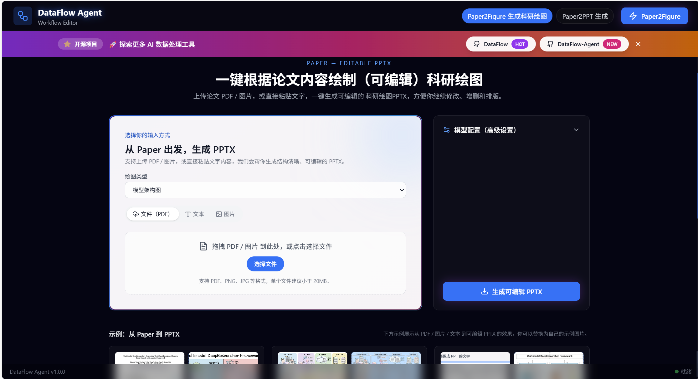
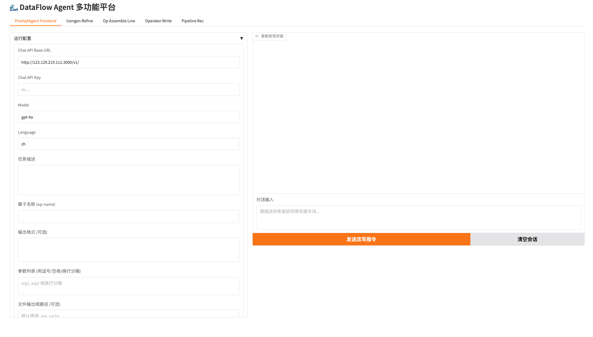
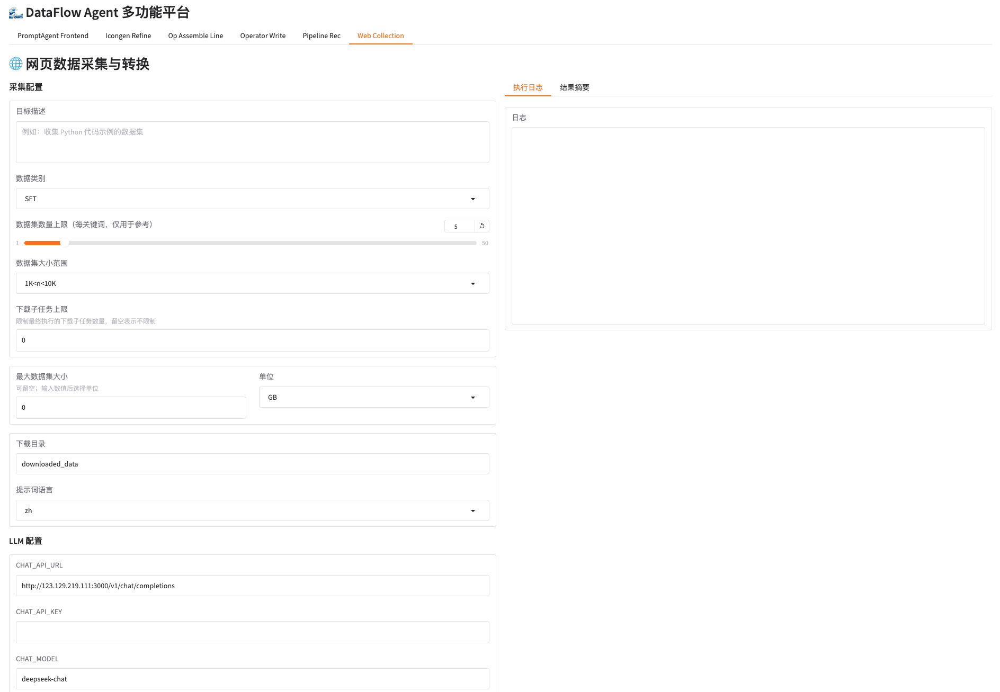
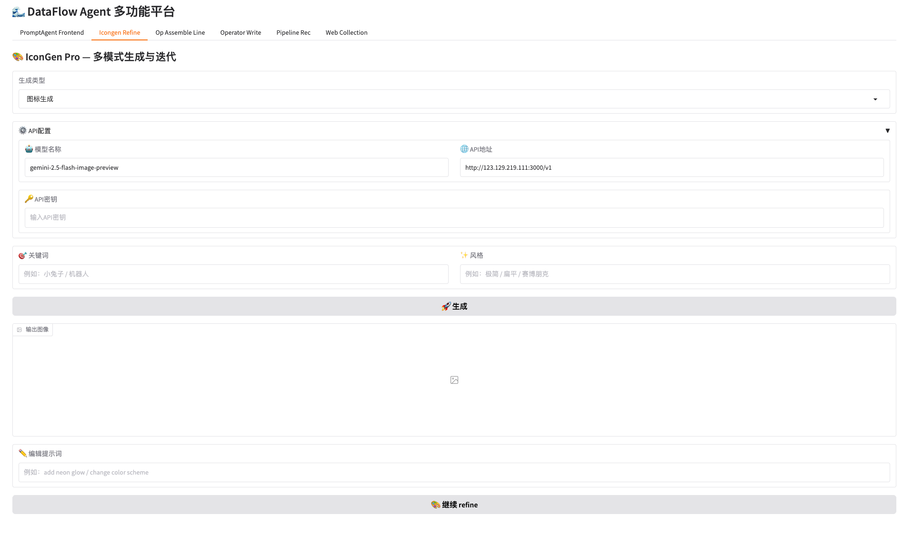
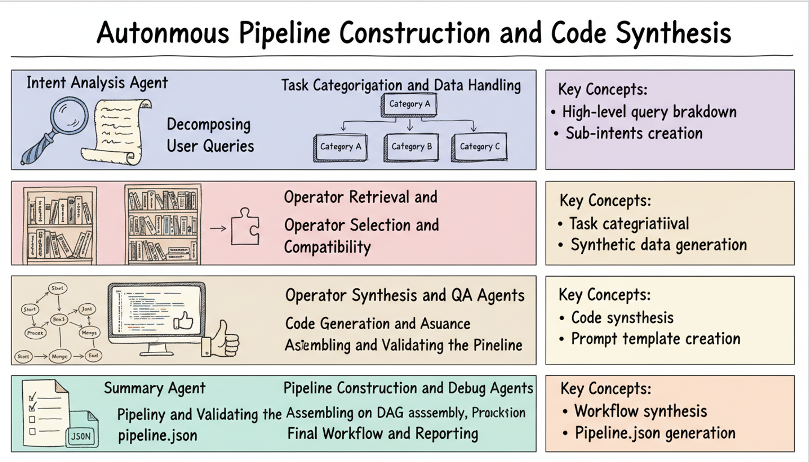
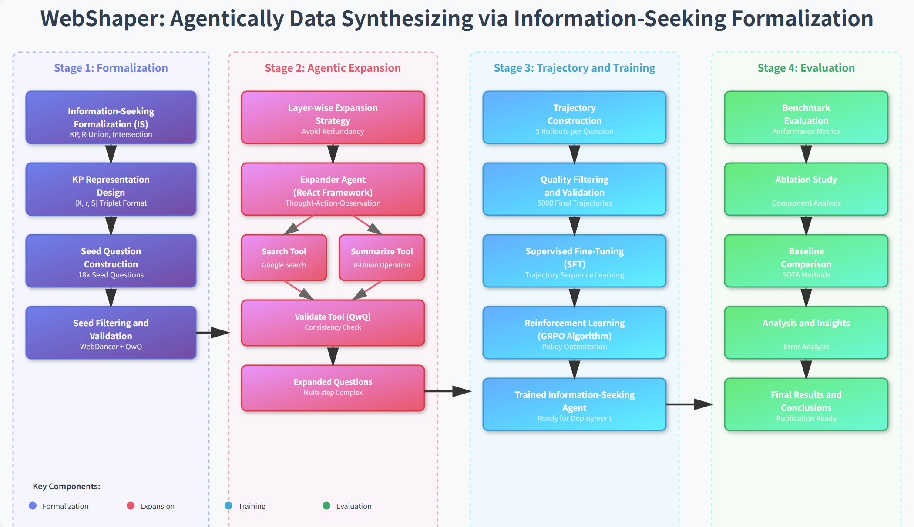
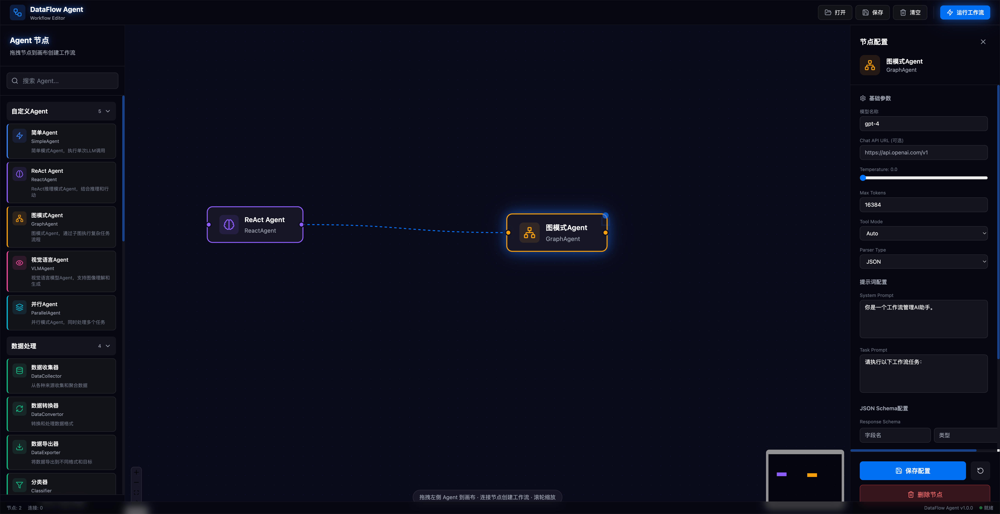

<div align="center">

<p align="center">
    
</p>


# 🌊 DataFlow-Agent

**AI驱动的数据处理与分析管线智能编排平台**

[](LICENSE)
[](https://www.python.org)
[](https://github.com/OpenDCAI/DataFlow)

[快速开始](#-快速开始) • [我们能做什么](#-我们能做什么) • [文档](docs/) • [贡献指南](#-贡献指南)

</div>

---

## 🚀 News

<!-- > 完整版本历史见 [docs/changelog.md](docs/changelog.md) -->

- `2025-12-12`: Paper2Figure网页端正式上线([http://dcai-paper2figure.cpolar.top/](http://dcai-paper2figure.cpolar.top/))，支持一键生成多种**可编辑**科研绘图，可凭邀请码试用。

 

- `2024-09-01`：发布 `0.1.0` 首个版本 🎉（详见 `docs/changelog.md`）

---

## 💡 我们能做什么

DataFlow-Agent 聚焦三大能力板块：

1. **Easy-DataFlow：数据治理管线的智能推荐与编排**
2. **Paper2Any：面向论文工作流的一站式 Agent 能力**
3. **DataFlow-Table：多源数据分析与自动化洞察**

---

### 1️⃣ 数据处理：数据治理管线推荐与编排

围绕「把原始数据加工成AI ready数据」，DataFlow-Agent 提供完整的数据治理能力，从管线推荐、算子编写、手动编排，到 Prompt 优化、Web 数据采集。

---

#### 📊 管线推荐：从任务描述到可执行管线代码

智能分析任务需求，自动推荐最优算子组合，并生成可执行的 Python 管线代码。

**输入**: 任务描述 + 数据样本  
**输出**: 可执行Python代码 + 处理结果  


---

#### ✍️ 算子编写（Operator Writer）：AI 辅助写算子

使用 LLM 辅助从功能描述自动生成算子代码，并在同一界面内完成测试与调试。

**输入**: 功能描述 + 测试数据  
**输出**: 算子代码 + 执行结果  


---

#### 🎨 手动编排（可视化 Workflow Builder）：拖拽式构建数据管线

通过可视化界面拖拽组合算子，自由搭建数据处理流程。

**输入**: 选择算子 + 配置参数  
**输出**: Pipeline代码 + 可视化图  


---

#### 🔄 Prompt 优化：复用算子与提示词自动调优

复用现有算子，能自动书写dataflow的算子prompttemplate。

**输入**: 算子名称 + 优化目标  
**输出**: 优化后的Prompt + 测试结果  



---

#### 🌐 Web 采集：从网页到结构化数据

自动化网页数据采集与结构化转换，可作为整个数据处理管线的起点，直接输出dataflow-ready数据。

**输入**: 目标描述 + 数据类别  
**输出**: 结构化数据文件 + 处理日志  



---

### 2️⃣ Paper2Any：从论文到代码与多模态表达

面向科研与论文工作流，DataFlow-Agent 计划/正在支持一系列 **Paper 系列 Agent 工作流**：
- 🖼️ **Paper2Figure**：**可编辑**图标 / 模型图 / 论文配图生成
- 🎬 **Paper2Video**：论文内容自动转讲解视频脚本与分镜描述  
- 🕸 **Paper2Web**：把论文结构化为交互式网页（章节导航、图表联动、代码片段等）  
- 📌 **Paper2Poster**：从论文自动生成学术海报草图（版式 + 要点提炼）
- 📚 **PaperCiter**：辅助引用管理，推荐相关工作与引用格式  
- 💻 **Paper2Code**：从论文方法部分抽取伪代码并转化为可执行代码草案  

---

#### 🖼️ **Paper2Figure**
基于关键词或论文内容自动生成**可编辑**图标、模型结构示意图、系统流程图、实验结果图等可视化素材，并支持用户自定义编辑。

**输入**: 关键词/论文内容 + 风格  
**输出**: 高质量图像 + 编辑能力  


<div style="display: flex; align-items: flex-start; justify-content: center;">
  
  
</div>

---

### 3️⃣ 数据分析：从多源数据到自动化洞察

在数据处理之上，DataFlow-Agent 提供**数据分析工作流**，帮助你快速从多源数据中得到洞察：

- 📥 **多数据源接入与清洗**  
  - 通过工具集接入数据库 / 文件 / Web / API 等多种数据源  
  - 使用推荐管线或自定义管线完成清洗、标准化与特征提取  

- 🧾 **自动化分析报告生成**  
  - 基于分析结果自动生成自然语言报告  
  - 支持「管理摘要 + 详细分析 + 附图」的结构化输出  
  - 可扩展为面向业务场景的模板（如运营报表、实验报告等）  

<!-- - 📈 **高级可视化与交互式报表**  
  - 通过 Gradio Web UI 或前端工作流项目（`frontend-workflow/`）构建交互界面  
  - 将分析管线封装成交互式页面，支持参数调优与结果实时刷新   -->

上述能力均可通过 **Agent + Workflow + Gradio 页面** 组合实现，你可以使用 CLI 脚手架快速创建相应模块。

---

## 🚀 快速开始

### 安装

```bash
git clone https://github.com/OpenDCAI/DataFlow-Agent.git
cd DataFlow-Agent
pip install -r requirements.txt
pip install -e .
```

### 启动Web界面

```bash
python gradio_app/app.py
```

访问 `http://127.0.0.1:7860` 开始使用

### CLI用法

参考`docs/cli.md`

---

## 📂 项目结构

```
DataFlow-Agent/
├── dataflow_agent/          # 核心代码
│   ├── agentroles/         # Agent定义（@register自动注册）
│   ├── workflow/           # Workflow定义（wf_*.py）
│   ├── promptstemplates/   # Prompt模板库
│   ├── toolkits/           # 工具集（LLM/Docker/Image等）
│   └── graphbuilder/       # StateGraph构建器
├── gradio_app/             # Web界面
│   ├── app.py             # 主程序
│   └── pages/             # 页面模块（自动发现）
├── docs/                   # 文档
└── script/                 # 脚本工具
```

---

## 🤝 贡献指南

参考 `docs/contributing.md`

---

## 🗓️ Roadmap

### 🛠️ 工具增强
- [ ] **Workflow可视化编辑器** - 拖拽式创建你的专属工作流
  - ```npm run dev```
  - 支持5种Agent模式（Simple/ReAct/Graph/VLM/Parallel）
  - 20+种预设Agent节点
  - 可视化节点配置与连线
  - 实时预览工作流结构
  
  <!-- 工作流编辑器截图 -->
  
  
- [ ] **轨迹数据导出** - 支持TRJ导出为多种训练格式
  - JSON/JSONL 格式导出
  - SFT 训练数据格式
  - DPO 成对数据格式
  - 统计信息分析

### 🎓 Paper系列
- [ ] Paper2Video - 论文转视频讲解
- [ ] Paper2Web - 论文转交互网页
- [ ] Paper2Poster - 论文转学术海报
- [ ] Paper2Graph - 论文转可编辑图像
- [ ] PaperCiter - 智能文献引用
- [ ] Paper2Code - 论文转可执行代码

### 📊 Data系列
- [ ] 多数据源深度分析 + 自动报告
- [ ] 智能取数与数据血缘追踪
- [ ] 高级数据可视化与交互式报表

<!-- ### 🚀 平台增强
- [ ] 分布式执行引擎
- [ ] 实时监控与告警
- [ ] 版本管理与回滚 -->

---

## 📄 License

本项目采用 [Apache License 2.0](LICENSE) 开源协议

---

## 🙏 致谢

感谢所有贡献者！特别感谢 [OpenDCAI/DataFlow](https://github.com/OpenDCAI/DataFlow) 上游项目

---

<div align="center">

**如果这个项目对你有帮助，请给我们一个 ⭐️ Star！**

[提交Issue](https://github.com/OpenDCAI/DataFlow-Agent/issues) • [查看文档](docs/) • [加入讨论](https://github.com/OpenDCAI/DataFlow-Agent/discussions)

</div>
