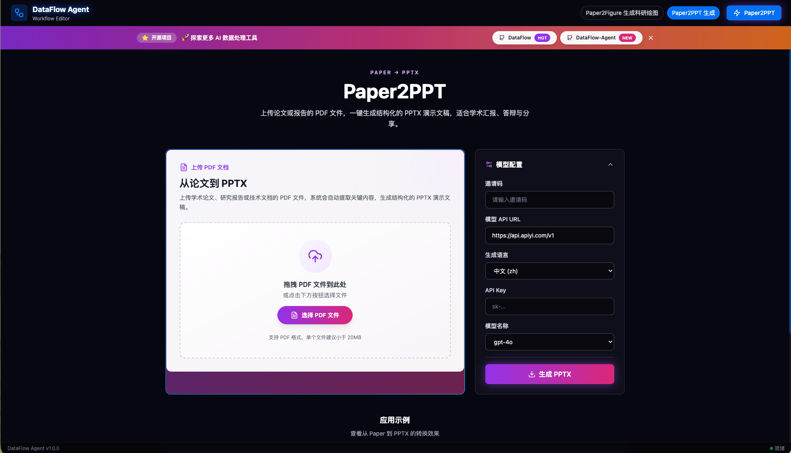
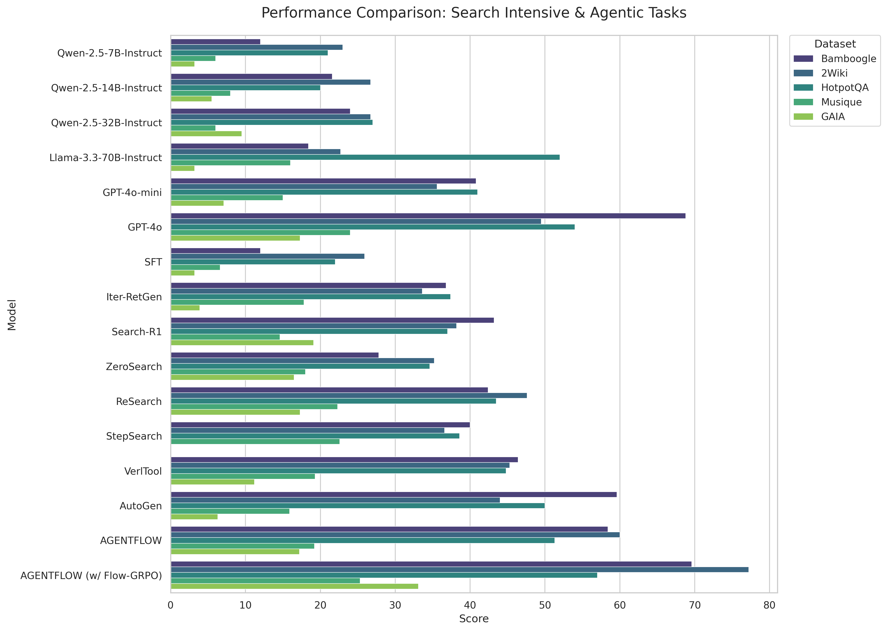
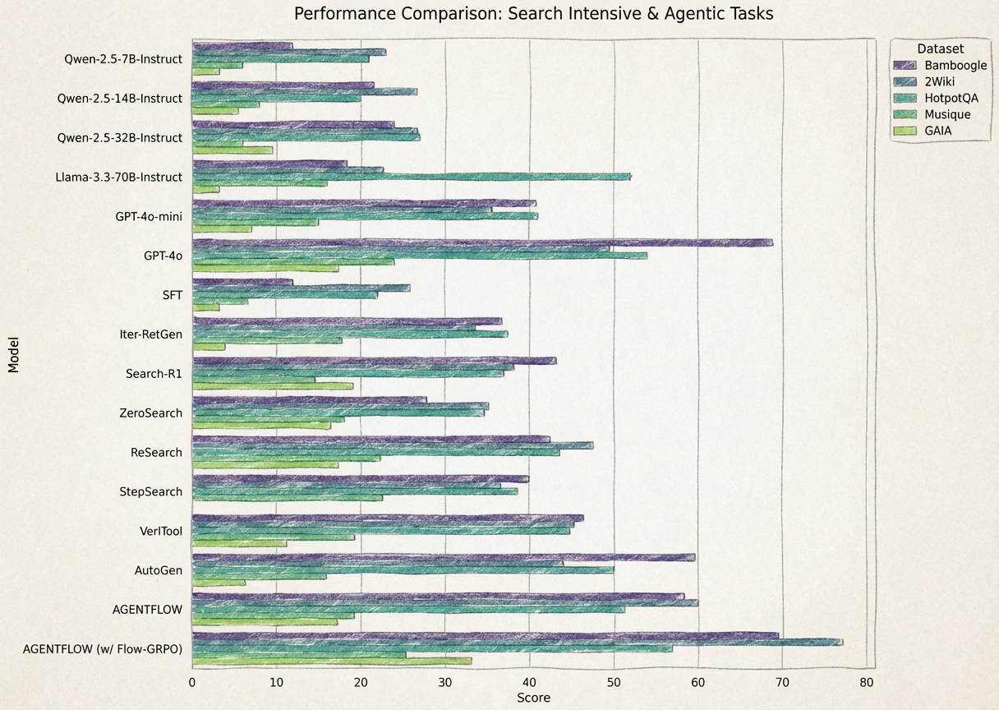

<div align="center">

<br>

# DataFlow-Agent

**AI-Powered Data & Paper Workflow Orchestration Platform**

[](https://www.python.org/)
[](LICENSE)
[](https://github.com/OpenDCAI/DataFlow-Agent)
[](https://github.com/OpenDCAI/DataFlow-Agent/stargazers)

<a href="https://dcai-paper2any.cpolar.top/" target="_blank">
  
</a>
<a href="docs/" target="_blank">
  
</a>
<a href="docs/contributing.md" target="_blank">
  
</a>

*基于DFA的AI Agent多功能平台*

中文 | [English](README_EN.md)

[快速开始](#-快速开始) • <a href="https://dcai-paper2any.cpolar.top/" target="_blank">在线体验</a> • <a href="docs/" target="_blank">文档</a> • <a href="docs/contributing.md" target="_blank">贡献指南</a>

</div>

---

## 📑 目录


- [🔥 News](#news)
- [📐 项目架构](#architecture)
- [✨ 核心应用](#core-apps)
  - [Paper2Any - 论文多模态工作流](#paper2any)
  - [Easy-DataFlow - 数据治理管线](#easy-dataflow)
- [🚀 快速开始](#quick-start)
- [📂 项目结构](#project-structure)
- [🗺️ Roadmap](#roadmap)
- [🤝 贡献](#contributing)

---


<a id="news"></a>
## 🔥 News

<table>
<tr>
<td width="120"><strong>2025.12.12</strong></td>
<td>
🎉 <strong>Paper2Figure 网页端内测上线</strong>（需邀请码）<br>
支持一键生成多种<strong>可编辑</strong>科研绘图，包括模型架构图、技术路线图、实验数据图<br>
📧 <strong>邮箱联系获取体验邀请码</strong>（仅限前50名）：<a href="mailto:liuzhou225919@163.com">liuzhou225919@163.com</a><br>
👉 访问地址：<a href="https://dcai-paper2any.cpolar.top/">https://dcai-paper2any.cpolar.top/</a>
</td>
</tr>
<tr>
<td><strong>2024.09.01</strong></td>
<td>
🚀 发布 <code>0.1.0</code> 首个版本（详见 <a href="docs/changelog.md">changelog</a>）
</td>
</tr>
</table>

<div align="center">
  
  
</div>

---

<a id="architecture"></a>
## 📐 项目架构

<div align="center">

<br><sub>DataFlow-Agent 的核心应用：Paper2Any（论文多模态工作流）、Easy-DataFlow（数据治理管线）</sub>
</div>

---

<a id="core-apps"></a>
## ✨ 核心应用

<a id="paper2any"></a>
### 1️⃣ Paper2Any - 论文多模态工作流

> 从论文 PDF / 图片 / 文本出发，一键生成**可编辑**的科研绘图、演示文稿、视频脚本、学术海报等多模态内容。

#### 🎯 核心功能

Paper2Any 当前包含以下几个子能力：

<table>
<tr>
<td width="50%" valign="top">

**📊 Paper2Figure - 可编辑科研绘图**
- ✅ 模型架构图生成
- ✅ 技术路线图生成（PPT + SVG）
- 🚧 实验数据图生成 (优化中)
- ✅ 支持 PDF / 图片 / 文本输入
- ✅ 输出可编辑 PPTX 格式

</td>
<td width="50%" valign="top">

**🎬 Paper2PPT - 可编辑演示文稿**
- ✅ Beamer 版本 PPT 生成
- 🚧 开放式可编辑 PPT 生成（开发中）

</td>
</tr>
<tr>
<td valign="top">

**🎬 Paper2Video - 论文讲解视频**
- 🚧 自动生成视频脚本
- 🚧 分镜描述与时间轴
- 🚧 配图素材推荐
- 🚧 视频自动合成（开发中）

</td>
<td valign="top">

**📌 Paper2Poster - 可编辑学术海报**
- 🚧 版式自动设计
- 🚧 要点提炼
- 🚧 视觉优化

</td>
</tr>
</table>

---

<details>
<summary><strong>展开查看 Paper2Figure Showcase</strong></summary>

#### 📸 ShowCase - Paper2Figure

##### 模型架构图生成

<table>
<tr>
<th width="33%">输入</th>
<th width="33%">生成图</th>
<th width="33%">PPTX 截图</th>
</tr>
<tr>
<td align="center">

<br><sub>📄 论文 PDF</sub>
</td>
<td align="center">

<br><sub>🎨 生成的模型架构图</sub>
</td>
<td align="center">

<br><sub>📊 可编辑 PPTX</sub>
</td>
</tr>
<tr>
<td colspan="3" align="center">
<strong>绘图难度：简单</strong> - 基础模型结构，清晰的模块划分
</td>
</tr>
<tr>
<td align="center">

<br><sub>📄 论文PDF</sub>
</td>
<td align="center">

<br><sub>🎨 生成的模型架构图</sub>
</td>
<td align="center">

<br><sub>📊 可编辑 PPTX</sub>
</td>
</tr>
<tr>
<td colspan="3" align="center">
<strong>绘图难度：中等</strong> - 包含多层次结构和数据流
</td>
</tr>
<tr>
<td align="center">

<br><sub>📄 输入核心段落</sub>
</td>
<td align="center">

<br><sub>🎨 生成的模型架构图</sub>
</td>
<td align="center">

<br><sub>📊 可编辑 PPTX</sub>
</td>
</tr>
<tr>
<td colspan="3" align="center">
<strong>绘图难度：困难</strong> - 复杂的多模块交互和详细注释
</td>
</tr>
</table>

<div align="center">

上传论文 PDF 文件，根据选择的**绘图难度**（简单/中等/困难），自动提取模型架构信息，生成对应复杂度的**可编辑 PPTX 格式**模型架构图。

</div>

---

##### 技术路线图生成

<table>
<tr>
<th width="33%">输入</th>
<th width="33%">生成图（SVG）</th>
<th width="33%">PPTX 截图</th>
</tr>
<tr>
<td align="center">

<br><sub>📝 论文方法部分（中文）</sub>
</td>
<td align="center">

<br><sub>🗺️ 技术路线图 SVG</sub>
</td>
<td align="center">

<br><sub>📊 可编辑 PPTX</sub>
</td>
</tr>
<tr>
<td colspan="3" align="center">
<strong>语言：中文</strong> - 中文技术路线图，适合国内学术交流
</td>
</tr>
<tr>
<td align="center">

<br><sub>📝 论文方法部分（英文）</sub>
</td>
<td align="center">

<br><sub>🗺️ 技术路线图 SVG</sub>
</td>
<td align="center">

<br><sub>📊 可编辑 PPTX</sub>
</td>
</tr>
<tr>
<td colspan="3" align="center">
<strong>语言：英文</strong> - 英文技术路线图，适合国际学术发表
</td>
</tr>
</table>

<div align="center">

粘贴论文方法部分文本，选择**语言**（中文/英文），自动梳理技术路线与模块依赖关系，生成**清晰的技术路线图 PPTX 与可编辑 SVG**。

</div>

---

##### 实验数据图生成

<table>
<tr>
<th width="33%">输入</th>
<th width="33%">常规实验图</th>
<th width="33%">精美实验图</th>
</tr>
<tr>
<td align="center">
  
  <br><sub>📄 输入：论文 PDF / 实验结果截图</sub>
</td>
<td align="center">
  
  <br><sub>📈 输出：常规 Python 风格实验数据图</sub>
</td>
<td align="center">
  
  <br><sub>🎨 输出：精美排版的实验数据图</sub>
</td>
</tr>
</table>

<div align="center">

上传实验结果截图或表格，自动抽取关键数据并生成**可编辑的实验数据图 PPTX**，同时提供常规和精美两种风格，便于论文和汇报复用。

</div>

---

</details>

#### 🖥️ 使用方式

**方式一：Web 前端（推荐）**

(目前在线版只支持邀请用户体验)访问在线体验地址：[https://dcai-paper2any.cpolar.top/](https://dcai-paper2any.cpolar.top/)

<div align="center">

</div>

**特点**：
- 🎨 现代化 UI 设计
- 📤 支持拖拽上传
- ⚙️ 可视化参数配置
- 📊 实时进度展示
- 📥 一键下载结果

<!-- 
**方式二：Gradio 界面**

```bash
python gradio_app/app.py
```

访问 `http://127.0.0.1:7860`

**特点**：
- 🚀 快速部署
- 🔧 灵活配置
- 📝 支持批量处理
-->

---

<a id="easy-dataflow"></a>
### 2️⃣ Easy-DataFlow - 数据治理管线

> 从任务描述到可执行数据处理管线，AI 驱动的数据治理全流程

#### 🎯 核心功能

| 功能模块 | 说明 | 状态 |
|---------|------|------|
| 📊 **管线推荐** | 从任务描述自动生成可执行 Python 管线代码 | ✅ |
| ✍️ **算子编写** | AI 辅助编写自定义数据处理算子 | ✅ |
| 🎨 **可视化编排** | 拖拽式构建数据处理流程 | ✅ |
| 🔄 **Prompt 优化** | 自动优化算子提示词，提升效果 | ✅ |
| 🌐 **Web 采集** | 自动化网页数据采集与结构化 | ✅ |

---

<details>
<summary><strong>展开查看 Easy-DataFlow 功能截图</strong></summary>

#### 📸 功能展示

**管线推荐：从任务到代码**

<div align="center">

<br><sub>💻 智能分析任务需求，自动推荐最优算子组合，生成可执行的 Python 管线代码</sub>
</div>

---

**算子编写：AI 辅助开发**

<div align="center">

<br><sub>⚙️ 使用 LLM 辅助从功能描述自动生成算子代码，并在同一界面内完成测试与调试</sub>
</div>

---

**可视化编排：拖拽式构建**

<div align="center">

<br><sub>🎨 通过可视化界面拖拽组合算子，自由搭建数据处理流程，所见即所得</sub>
</div>

---

**Prompt 优化：自动调优**

<div align="center">

<br><sub>✨ 复用现有算子，自动书写 DataFlow 的算子 Prompt Template，智能优化提示词</sub>
</div>

---

**Web 采集：网页到数据**

<div align="center">

<br><sub>📊 自动化网页数据采集与结构化转换，直接输出 DataFlow-ready 数据</sub>
</div>

---

</details>

<a id="quick-start"></a>
## 🚀 快速开始

### 环境要求


### 安装步骤

> 建议使用 Conda 创建隔离环境（推荐 Python 3.12）。

```bash
# 0. 创建并激活 conda 环境
conda create -n dataflow-agent python=3.12 -y
conda activate dataflow-agent

# 1. 克隆仓库
git clone https://github.com/OpenDCAI/DataFlow-Agent.git
cd DataFlow-Agent

# 2. 安装依赖（基础）
pip install -r requirements.txt

# 3. 安装包（开发模式）
pip install -e .
```

#### Paper2Any 额外依赖（可选，但推荐）

Paper2Any 需要额外依赖（见 `requirements-paper.txt`），以及一些系统/conda 工具用于渲染与矢量图处理：

<details>
<summary><strong>展开：Paper2Any 额外依赖安装</strong></summary>

```bash
# 安装 Paper2Any 依赖
pip install -r requirements-paper.txt

# tectonic：建议用 conda 单独安装（LaTeX 引擎）
conda install -c conda-forge tectonic -y

# inkscape：用于 SVG/矢量图相关处理（Linux）
sudo apt-get update
sudo apt-get install -y inkscape
```

</details>

### 配置环境

```bash
export DF_API_KEY=your_api_key_here
export DF_API_URL=xxx 
# 如果需要使用第三方API中转站
```
<details>
<summary><strong>可选：第三方 API 中转站</strong></summary>

- https://api.apiyi.com/
- http://123.129.219.111:3000/

</details>

---

### 启动应用

> [!NOTE]
> **Paper2Any**：从论文 PDF / 图片 / 文本一键生成可编辑的科研绘图、技术路线图、实验数据图和演示文稿。

#### 🎨 Paper2Any - 论文工作流

**Web 前端（推荐）**

> 前端需要 Node.js 18+。

```bash
# 启动后端 API（终端 1）
cd fastapi_app
uvicorn main:app --host 0.0.0.0 --port 9999

# 启动前端（终端 2）
cd frontend-workflow
npm install
npm run dev
```

访问 `http://localhost:3000`

> [!NOTE]
> `frontend-workflow/vite.config.ts` 默认已将 `/api` 代理到 `http://127.0.0.1:9999`。

<details>
<summary><strong>如需修改前端代理端口（vite.config.ts）</strong></summary>

```ts
import { defineConfig } from 'vite'
import react from '@vitejs/plugin-react'

export default defineConfig({
  plugins: [react()],
  server: {
    port: 3000,
    open: true,
    allowedHosts: true,
    proxy: {
      '/api': {
        target: 'http://127.0.0.1:9999', // FastAPI 后端地址
        changeOrigin: true,
      },
    },
  },
})
```

</details>

> [!TIP]
> **Paper2Figure 网页端内测说明**
> - 当你部署了前端，还需要**手动新建**一个 `invite_codes.txt` 文件，并写入你的邀请码（例如：`ABCDEFG123456`）。
> - 然后再启动后端；
> - 如果暂时不想部署前后端，可以先通过本地脚本体验 Paper2Any 的核心能力：
>   - `python tests/test_paper2figure_with_sam.py`：模型架构图生成
>   - `python tests/test_paper2technical.py`：技术路线图生成
>   - `python tests/test_paper2video.py`：Beamer PPT 生成

**特点**：
- ✨ 现代化 UI 设计
- 🎯 可视化参数配置
- 📊 实时进度展示
- 📥 一键下载结果

---

> [!NOTE]
> **Easy-DataFlow**：从自然语言任务描述出发，自动推荐算子与管线结构，生成可执行的数据处理管线。

#### 📊 Easy-DataFlow - 数据治理

**Gradio Web 界面**

```bash
python gradio_app/app.py
```

访问 `http://127.0.0.1:7860`

**特点**：
- 🚀 快速部署
- 🔧 灵活配置
- 📝 支持批量处理
---

<a id="project-structure"></a>
## 📂 项目结构

```
DataFlow-Agent/
├── dataflow_agent/          # 核心框架代码
│   ├── agentroles/         # Agent 定义（@register 自动注册）
│   ├── workflow/           # Workflow 定义（wf_*.py）
│   ├── promptstemplates/   # Prompt 模板库
│   ├── toolkits/           # 工具集（LLM/Docker/Image 等）
│   ├── graphbuilder/       # StateGraph 构建器
│   └── states/             # 状态管理
├── gradio_app/             # Gradio Web 界面
│   ├── app.py             # 主程序
│   └── pages/             # 页面模块（自动发现）
├── fastapi_app/            # FastAPI 后端服务
│   ├── main.py            # API 入口
│   └── routers/           # 路由模块
├── frontend-workflow/      # 前端工作流编辑器
│   ├── src/               # 源代码
│   └── public/            # 静态资源
├── docs/                   # 文档
├── static/                 # 静态资源（图片等）
├── script/                 # 脚本工具
└── tests/                  # 测试用例
```

---

<a id="roadmap"></a>
## 🗺️ Roadmap

> [!NOTE]
> Roadmap 表格较长，默认折叠；点击展开查看完整内容。

<details>
<summary><strong>展开查看完整 Roadmap（表格）</strong></summary>

### 🎓 Paper 系列

<table>
<tr>
<th width="35%">功能</th>
<th width="15%">状态</th>
<th width="50%">子功能</th>
</tr>
<tr>
<td><strong>📊 Paper2Figure</strong><br><sub>可编辑科研绘图</sub></td>
<td></td>
<td>
<br>
<br>
<br>

</td>
</tr>
<tr>
<td><strong>🎬 Paper2Video</strong><br><sub>论文讲解视频</sub></td>
<td></td>
<td>
<br>
<br>
<br>

</td>
</tr>
<tr>
<td><strong>🎬 Paper2PPT</strong><br><sub>可编辑演示文稿</sub></td>
<td></td>
<td>
<br>

</td>
</tr>
<tr>
<td><strong>📌 Paper2Poster</strong><br><sub>可编辑学术海报</sub></td>
<td></td>
<td>
<br>
<br>

</td>
</tr>
<tr>
<td><strong>🧪 Paper2Exp</strong><br><sub>自动实验运行器</sub></td>
<td></td>
<td>
<br>
<br>

</td>
</tr>
<tr>
<td><strong>📚 PaperCiter</strong><br><sub>智能文献引用</sub></td>
<td></td>
<td>
<br>

</td>
</tr>
</table>

---

### 📊 Data 系列

<table>
<tr>
<th width="35%">功能</th>
<th width="15%">状态</th>
<th width="50%">子功能</th>
</tr>
<tr>
<td><strong>🔄 Easy-DataFlow</strong><br><sub>数据治理管线</sub></td>
<td></td>
<td>
<br>
<br>
<br>
<br>

</td>
</tr>
</table>

---

### 🛠️ 工具增强

<table>
<tr>
<th width="35%">功能</th>
<th width="15%">状态</th>
<th width="50%">子功能</th>
</tr>
<tr>
<td><strong>🎨 Workflow 可视化编辑器</strong><br><sub>拖拽式工作流构建器</sub></td>
<td></td>
<td>
<br>
<br>

</td>
</tr>
<tr>
<td><strong>💾 轨迹数据导出</strong><br><sub>训练数据导出</sub></td>
<td></td>
<td>
<br>
<br>

</td>
</tr>
</table>

<div align="center">

<br><sub>🎨 Workflow 可视化编辑器预览</sub>
</div>

---

</details>

<a id="contributing"></a>
## 🤝 贡献

我们欢迎所有形式的贡献！

[](https://github.com/OpenDCAI/DataFlow-Agent/issues)
[](https://github.com/OpenDCAI/DataFlow-Agent/discussions)
[](https://github.com/OpenDCAI/DataFlow-Agent/pulls)

详细贡献指南：[docs/contributing.md](docs/contributing.md)

---

## 📄 License

[](LICENSE)

本项目采用 [Apache License 2.0](LICENSE) 开源协议

---

## 🙏 致谢

感谢所有贡献者！特别感谢 [OpenDCAI/DataFlow](https://github.com/OpenDCAI/DataFlow) 上游项目

---

<div align="center">

**如果这个项目对你有帮助，请给我们一个 ⭐️ Star！**

[](https://github.com/OpenDCAI/DataFlow-Agent/stargazers)
[](https://github.com/OpenDCAI/DataFlow-Agent/network/members)

[提交 Issue](https://github.com/OpenDCAI/DataFlow-Agent/issues) • [查看文档](docs/) • [加入讨论](https://github.com/OpenDCAI/DataFlow-Agent/discussions)

Made with ❤️ by OpenDCAI Team

</div>

---

## 🌐 加入社区

加入 DataFlow 开源社区，一起交流想法、反馈问题、共建生态！

- 📮 **GitHub Issues**：用于反馈 Bug 或提交功能建议  
  👉 https://github.com/OpenDCAI/DataFlow-Agent/issues
- 🔧 **GitHub Pull Requests**：提交代码改进与文档优化  
  👉 https://github.com/OpenDCAI/DataFlow-Agent/pulls
- 💬 **社区交流群**：与开发者和贡献者实时交流

<div align="center">
  
  <br>
  <sub>扫码加入 DataFlow-Agent 社区微信群</sub>
</div>
