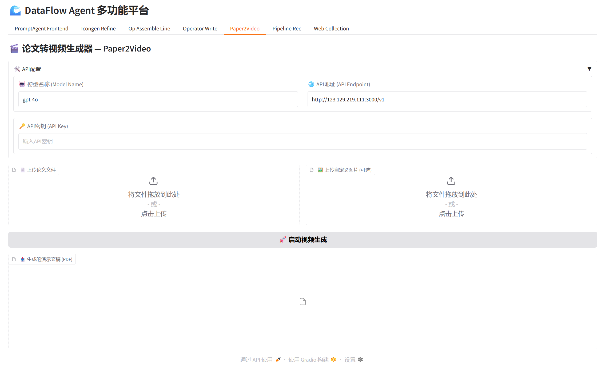

<div align="center">

<p align="center">
  
</p>

# 🌊 DataFlow-Agent

**AI驱动的数据处理与分析管线智能编排平台**

[](LICENSE)
[](https://www.python.org)
[](https://github.com/OpenDCAI/DataFlow)

[快速开始](#-快速开始) • [我们能做什么](#-我们能做什么) • [文档](docs/) • [贡献指南](#-贡献指南)

</div>

---

## 🆕 最近更新

<!-- > 完整版本历史见 [docs/changelog.md](docs/changelog.md) -->

- `2024-09-01`：发布 `0.1.0` 首个版本 🎉（详见 `docs/changelog.md`）

---

## 💡 我们能做什么

DataFlow-Agent 聚焦三大能力板块：

1. **数据处理：数据治理管线的智能推荐与编排**
2. **数据分析：多源数据分析与自动化洞察**
3. **Paper 系列应用：面向论文工作流的一站式 Agent 能力**

下面分别展开。

---

### 1️⃣ 数据处理：数据治理管线推荐与编排

围绕「把原始数据加工成AI ready数据」，DataFlow-Agent 提供完整的数据治理能力，从管线推荐、算子编写、手动编排，到 Prompt 优化、Web 数据采集。

---

#### 📊 管线推荐：从任务描述到可执行管线代码

智能分析任务需求，自动推荐最优算子组合，并生成可执行的 Python 管线代码。

**输入**: 任务描述 + 数据样本  
**输出**: 可执行Python代码 + 处理结果  


---

#### ✍️ 算子编写（Operator Writer）：AI 辅助写算子

使用 LLM 辅助从功能描述自动生成算子代码，并在同一界面内完成测试与调试。

**输入**: 功能描述 + 测试数据  
**输出**: 算子代码 + 执行结果  


---

#### 🎨 手动编排（可视化 Workflow Builder）：拖拽式构建数据管线

通过可视化界面拖拽组合算子，自由搭建数据处理流程。

**输入**: 选择算子 + 配置参数  
**输出**: Pipeline代码 + 可视化图  


---

#### 🔄 Prompt 优化：复用算子与提示词自动调优

复用现有算子，能自动书写dataflow的算子prompttemplate。

**输入**: 算子名称 + 优化目标  
**输出**: 优化后的Prompt + 测试结果  


---

#### 🌐 Web 采集：从网页到结构化数据

自动化网页数据采集与结构化转换，可作为整个数据处理管线的起点，直接输出dataflow-ready数据。

**输入**: 目标描述 + 数据类别  
**输出**: 结构化数据文件 + 处理日志  


---


### 2️⃣ 数据分析：从多源数据到自动化洞察

在数据处理之上，DataFlow-Agent 提供**数据分析工作流**，帮助你快速从多源数据中得到洞察：

- 📥 **多数据源接入与清洗**  
  - 通过工具集接入数据库 / 文件 / Web / API 等多种数据源  
  - 使用推荐管线或自定义管线完成清洗、标准化与特征提取  

- 🧾 **自动化分析报告生成**  
  - 基于分析结果自动生成自然语言报告  
  - 支持「管理摘要 + 详细分析 + 附图」的结构化输出  
  - 可扩展为面向业务场景的模板（如运营报表、实验报告等）  

<!-- - 📈 **高级可视化与交互式报表**  
  - 通过 Gradio Web UI 或前端工作流项目（`frontend-workflow/`）构建交互界面  
  - 将分析管线封装成交互式页面，支持参数调优与结果实时刷新   -->

上述能力均可通过 **Agent + Workflow + Gradio 页面** 组合实现，你可以使用 CLI 脚手架快速创建相应模块。

---

### 3️⃣ Paper 系列应用：从论文到代码与多模态表达

面向科研与论文工作流，DataFlow-Agent 计划/正在支持一系列 **Paper 系列 Agent 工作流**：

#### 🎬 **Paper2Video**：论文内容自动转讲解视频脚本与分镜描述 
 本工作流基于论文关键词或结构化内容摘要，自动生成图标、模型结构示意图、核心数据可视化等讲解视频所需的可视化素材，并将这些素材作为分镜描述的关键元素嵌入到视频脚本中。

**输入**: 论文(pdf格式) + 用户自定义补充图片  
**输出**: 高质量汇报ppt(pdf格式)  



- 🕸 **Paper2Web**：把论文结构化为交互式网页（章节导航、图表联动、代码片段等）  
- 📌 **Paper2Poster**：从论文自动生成学术海报草图（版式 + 要点提炼）  
#### 🖼️ **Paper2Graph**图像生成：图标 / 模型图 / 论文配图生成

基于关键词或论文内容自动生成图标、模型结构示意图等可视化素材，并支持迭代优化，是 Paper 系列工作流的重要补充。

**输入**: 关键词/论文内容 + 风格  
**输出**: 高质量图像 + 编辑能力  


- 📚 **PaperCiter**：辅助引用管理，推荐相关工作与引用格式  
- 💻 **Paper2Code**：从论文方法部分抽取伪代码并转化为可执行代码草案  

这些能力将基于同一套 **Agent / Workflow / Toolkits / Prompt 模板** 架构实现，方便你二次开发自己的 Paper 工作流。

---

## 💡 核心亮点

🎯 **智能推荐** - 基于任务描述自动推荐最优数据处理管线  
🔧 **算子编写** - AI辅助生成自定义算子，支持调试与优化  
🔄 **Prompt优化** - 智能复用与优化算子提示词，提升效果  
🌐 **Web采集** - 自动化网页数据采集与结构化转换  
🖼️ **图像生成** - 支持图标/模型图生成与迭代优化

---

## 🚀 快速开始

### 安装

```bash
git clone https://github.com/OpenDCAI/DataFlow-Agent.git
cd DataFlow-Agent
pip install -r requirements.txt
pip install -e .
```

### 启动Web界面

```bash
python gradio_app/app.py
```

访问 `http://127.0.0.1:7860` 开始使用

### 🛠️ CLI脚手架

DataFlow-Agent提供强大的代码生成工具，基于Jinja2模板自动创建标准化代码文件。

#### 支持的模板类型

| 命令参数 | 功能说明 | 生成文件 | 自动集成 |
|---------|---------|---------|---------|
| `--agent_name` | 创建Agent角色 | `agentroles/{name}_agent.py` | ✅ @register装饰器 |
| `--wf_name` | 创建Workflow | `workflow/wf_{name}.py` + `tests/test_{name}.py` | ✅ @register装饰器 |
| `--gradio_name` | 创建Gradio页面 | `gradio_app/pages/page_{name}.py` | ✅ 自动发现 |
| `--prompt_name` | 创建Prompt模板 | `promptstemplates/resources/pt_{name}_repo.py` | 手动引用 |
| `--state_name` | 创建自定义State | `states/{name}_state.py` | 手动引用 |
| `--agent_as_tool_name` | 创建Agent工具 | `agentroles/{name}_agent.py` | ✅ @register + as_tool |

#### 快速开始

```bash
# 1. 创建一个数据清洗Agent
dfa create --agent_name data_cleaner

# 2. 创建对应的Workflow（自动生成测试文件）
dfa create --wf_name data_cleaning_pipeline

# 3. 创建Web界面页面
dfa create --gradio_name data_cleaner_ui

# 4. 创建Prompt模板库
dfa create --prompt_name data_cleaning_prompts

# 5. 创建自定义State对象
dfa create --state_name data_cleaning_state

# 6. 创建可作为工具调用的Agent
dfa create --agent_as_tool_name text_analyzer
```

#### 详细示例

<details>
<summary><b>📝 创建Agent</b></summary>

```bash
dfa create --agent_name sentiment_analyzer
```

**生成文件**: `dataflow_agent/agentroles/common_agents/sentiment_analyzer_agent.py`

**核心特性**:
- ✅ 自动注册到Agent注册中心（`@register("sentiment_analyzer")`）
- ✅ 包含完整的BaseAgent实现框架
- ✅ 预置prompt模板配置接口
- ✅ 支持多种执行策略（Simple/ReAct/Graph/VLM）
- ✅ 提供异步执行函数和工厂函数

**生成的代码结构**:
```python
@register("sentiment_analyzer")
class SentimentAnalyzer(BaseAgent):
    @property
    def system_prompt_template_name(self) -> str:
        return "system_prompt_for_sentiment_analyzer"
    
    def get_task_prompt_params(self, pre_tool_results) -> Dict:
        # TODO: 自定义参数映射
        return {}

# 便捷调用函数
async def sentiment_analyzer(state, **kwargs) -> MainState:
    agent = SentimentAnalyzer.create(**kwargs)
    return await agent.execute(state)
```

</details>

<details>
<summary><b>🔄 创建Workflow</b></summary>

```bash
dfa create --wf_name text_processing
```

**生成文件**: 
- `dataflow_agent/workflow/wf_text_processing.py` - 工作流定义
- `tests/test_text_processing.py` - 单元测试

**核心特性**:
- ✅ 自动注册到Workflow注册中心（`@register("text_processing")`）
- ✅ 基于StateGraph的节点和边定义框架
- ✅ 预置pre_tool和post_tool装饰器示例
- ✅ 包含完整的测试用例模板
- ✅ 支持多种Agent创建策略示例

**生成的代码结构**:
```python
@register("text_processing")
def create_text_processing_graph() -> GenericGraphBuilder:
    builder = GenericGraphBuilder(state_model=xxState, entry_point="step1")
    
    # 定义前置工具
    @builder.pre_tool("purpose", "step1")
    def _purpose(state):
        return "工具描述"
    
    # 定义节点
    async def step1(state):
        agent = create_simple_agent(name="your_agent", ...)
        return await agent.execute(state)
    
    # 注册节点和边
    builder.add_nodes({"step1": step1}).add_edges([("step1", "_end_")])
    return builder
```

**运行测试**:
```bash
pytest tests/test_text_processing.py -v -s
```

</details>

<details>
<summary><b>🎨 创建Gradio页面</b></summary>

```bash
dfa create --gradio_name model_hub
```

**生成文件**: `gradio_app/pages/page_model_hub.py`

**核心特性**:
- ✅ 自动被`gradio_app/app.py`发现并加载
- ✅ 函数名遵循`create_{page_name}`规范
- ✅ 包含Gradio组件示例和工作流调用模板
- ✅ 预置异步执行函数框架

**生成的代码结构**:
```python
def create_model_hub() -> gr.Blocks:
    with gr.Blocks() as page:
        gr.Markdown("## Model Hub")
        # TODO: 添加组件
    return page

async def run_xxx_pipeline(...):
    # TODO: 调用workflow
    state = await run_workflow("wf_xxx", state)
    return state
```

**自动集成**: 重启`python gradio_app/app.py`后，新页面自动出现在Tab栏

</details>

<details>
<summary><b>💬 创建Prompt模板</b></summary>

```bash
dfa create --prompt_name code_review
```

**生成文件**: `dataflow_agent/promptstemplates/resources/pt_code_review_repo.py`

**生成的代码结构**:
```python
class CodeReview:
    task_prompt_for_example = """
    Your task description here.
    Input: {input_data}
    """
    
    system_prompt_for_example = """
    You are an AI assistant for code review tasks.
    """
```

**使用方式**:
```python
from dataflow_agent.promptstemplates.resources.pt_code_review_repo import CodeReview

# 在Agent中引用
@property
def task_prompt_template_name(self) -> str:
    return "task_prompt_for_example"
```

</details>

<details>
<summary><b>📦 创建自定义State</b></summary>

```bash
dfa create --state_name image_processing
```

**生成文件**: `dataflow_agent/states/image_processing_state.py`

**生成的代码结构**:
```python
@dataclass
class ImageProcessingRequest(MainRequest):
    """自定义请求参数"""
    pass

@dataclass
class ImageProcessingState(MainState):
    """自定义状态对象"""
    request: ImageProcessingRequest = field(default_factory=ImageProcessingRequest)
```

**使用方式**:
```python
from dataflow_agent.states.image_processing_state import ImageProcessingState

state = ImageProcessingState(messages=[])
```

</details>

<details>
<summary><b>🔧 创建Agent-as-Tool</b></summary>

```bash
dfa create --agent_as_tool_name text_summarizer
```

**生成文件**: `dataflow_agent/agentroles/text_summarizer_agent.py`

**核心特性**:
- ✅ 可作为普通Agent使用
- ✅ 可作为Tool被其他Agent调用
- ✅ 支持自定义工具描述和参数Schema
- ✅ 自动参数转换和映射

**生成的代码结构**:
```python
@register("text_summarizer")
class TextSummarizer(BaseAgent):
    # 可重写以下方法自定义工具行为
    def get_tool_description(self) -> str:
        return "用于总结文本内容"
    
    def get_tool_args_schema(self) -> type[BaseModel]:
        class SummarizerArgs(BaseModel]:
            content: str = Field(description="要总结的内容")
            max_length: int = Field(default=500)
        return SummarizerArgs
```

**作为工具使用**:
```python
# 在其他Agent的Workflow中
agent = create_graph_agent(name="orchestrator", tool_mode="auto")
# text_summarizer会自动作为可用工具
```

</details>

#### 模板特性

- 🕐 **时间戳**: 每个生成文件包含创建时间
- 🔤 **智能命名**: 自动转换snake_case/CamelCase
- 📝 **TODO标记**: 关键位置预留TODO注释
- 🎯 **最佳实践**: 遵循项目编码规范
- 🔗 **自动集成**: Agent/Workflow自动注册，Gradio页面自动发现

#### 命名规范

CLI工具会自动处理命名转换：

```bash
# 输入任意格式
dfa create --agent_name "My Data Processor"
dfa create --agent_name "my-data-processor"
dfa create --agent_name "my_data_processor"

# 统一转换为
# - 文件名: my_data_processor_agent.py
# - 类名: MyDataProcessor
# - 注册名: "my_data_processor"
```

---


## 🏗️ 架构特色

```
┌─────────────────────────────────────────────────────────┐
│                    Gradio Web UI                        │
│  管线推荐 | 算子编写 | 手动编排 | Prompt优化 | Web采集   │
└─────────────────────────────────────────────────────────┘
                            ↓
┌─────────────────────────────────────────────────────────┐
│                  Workflow Engine                        │
│  StateGraph编排 | 自动注册 | 流程控制 | 状态管理        │
└─────────────────────────────────────────────────────────┘
                            ↓
┌─────────────────────────────────────────────────────────┐
│                   Agent Roles                           │
│  Recommender | Writer | Executor | Optimizer | ...      │
└─────────────────────────────────────────────────────────┘
                            ↓
┌─────────────────────────────────────────────────────────┐
│                   Tool Manager                          │
│  LLM调用 | 文件操作 | Docker执行 | 图像处理 | ...       │
└─────────────────────────────────────────────────────────┘
```

**核心优势**:
- 🔌 **插件化**: Agent/Workflow自动注册，开箱即用
- 🎯 **策略模式**: 支持Simple/ReAct/Graph/VLM多种执行策略
- 💾 **持久化**: Agent结果自动存储，支持断点续传
- 🖼️ **多模态**: 集成VLM能力，支持图像理解与生成

---

## 📂 项目结构

```
DataFlow-Agent/
├── dataflow_agent/          # 核心代码
│   ├── agentroles/         # Agent定义（@register自动注册）
│   ├── workflow/           # Workflow定义（wf_*.py）
│   ├── promptstemplates/   # Prompt模板库
│   ├── toolkits/           # 工具集（LLM/Docker/Image等）
│   └── graphbuilder/       # StateGraph构建器
├── gradio_app/             # Web界面
│   ├── app.py             # 主程序
│   └── pages/             # 页面模块（自动发现）
├── docs/                   # 文档
└── script/                 # 脚本工具
```

---

## 🤝 贡献指南

### 开发流程

```bash
# 1. Fork并克隆
git clone https://github.com/<your-username>/DataFlow-Agent.git
cd DataFlow-Agent

# 2. 安装开发依赖
pip install -r requirements-dev.txt
pip install -e .

# 3. 创建分支
git checkout -b feature/your-feature

# 4. 运行测试
pytest

# 5. 提交PR
git push origin feature/your-feature
```

### 添加新Agent

```python
from dataflow_agent.agentroles.base_agent import BaseAgent
from dataflow_agent.agentroles.registry import register

@register("my_agent")  # 自动注册
class MyAgent(BaseAgent):
    @classmethod
    def create(cls, tool_manager=None, **kwargs):
        return cls(tool_manager=tool_manager, **kwargs)
```

### 添加新Workflow

```python
# 文件: dataflow_agent/workflow/wf_my_workflow.py
from dataflow_agent.workflow.registry import register
from dataflow_agent.graphbuilder import GraphBuilder

@register("my_workflow")  # 注册名 = 文件名去掉wf_前缀
def create_my_workflow_graph():
    builder = GraphBuilder()
    # 定义节点和边...
    return builder
```

### 添加Gradio页面

```python
# 文件: gradio_app/pages/my_page.py
import gradio as gr

def create_my_page():  # 函数名 = create_ + 文件名
    with gr.Blocks() as page:
        gr.Markdown("## 我的页面")
        # 添加组件...
    return page
```

### 文档贡献

```bash
# 本地预览
pip install mkdocs-material
mkdocs serve  # 访问 http://127.0.0.1:8000

# 添加新页面
# 1. 在docs/对应目录创建.md文件
# 2. 在mkdocs.yml的nav中添加链接
# 3. 提交PR
```

---

## 🗓️ Roadmap

### 🛠️ 工具增强
- [ ] **Workflow可视化编辑器** - 拖拽式创建你的专属工作流
  - ```npm run dev```
  - 支持5种Agent模式（Simple/ReAct/Graph/VLM/Parallel）
  - 20+种预设Agent节点
  - 可视化节点配置与连线
  - 实时预览工作流结构
  
  <!-- 工作流编辑器截图 -->
  
  
- [ ] **轨迹数据导出** - 支持TRJ导出为多种训练格式
  - JSON/JSONL 格式导出
  - SFT 训练数据格式
  - DPO 成对数据格式
  - 统计信息分析

### 🎓 Paper系列
- [ ] Paper2Video - 论文转视频讲解
- [ ] Paper2Web - 论文转交互网页
- [ ] Paper2Poster - 论文转学术海报
- [ ] Paper2Graph - 论文转可编辑图像
- [ ] PaperCiter - 智能文献引用
- [ ] Paper2Code - 论文转可执行代码

### 📊 Data系列
- [ ] 多数据源深度分析 + 自动报告
- [ ] 智能取数与数据血缘追踪
- [ ] 高级数据可视化与交互式报表

<!-- ### 🚀 平台增强
- [ ] 分布式执行引擎
- [ ] 实时监控与告警
- [ ] 版本管理与回滚 -->

---

## 📄 License

本项目采用 [Apache License 2.0](LICENSE) 开源协议

---

## 🙏 致谢

感谢所有贡献者！特别感谢 [OpenDCAI/DataFlow](https://github.com/OpenDCAI/DataFlow) 上游项目

---

<div align="center">

**如果这个项目对你有帮助，请给我们一个 ⭐️ Star！**

[提交Issue](https://github.com/OpenDCAI/DataFlow-Agent/issues) • [查看文档](docs/) • [加入讨论](https://github.com/OpenDCAI/DataFlow-Agent/discussions)

</div>
