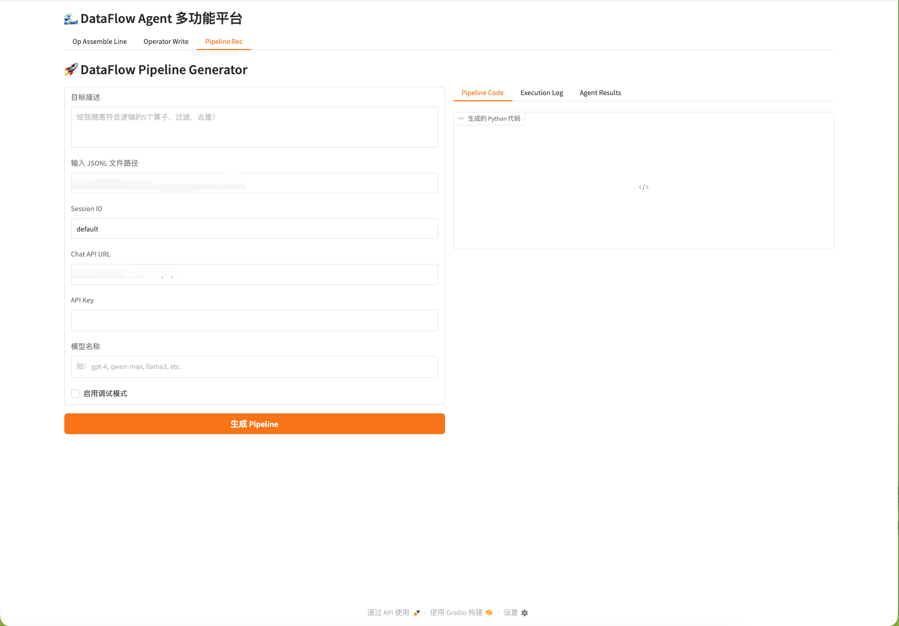
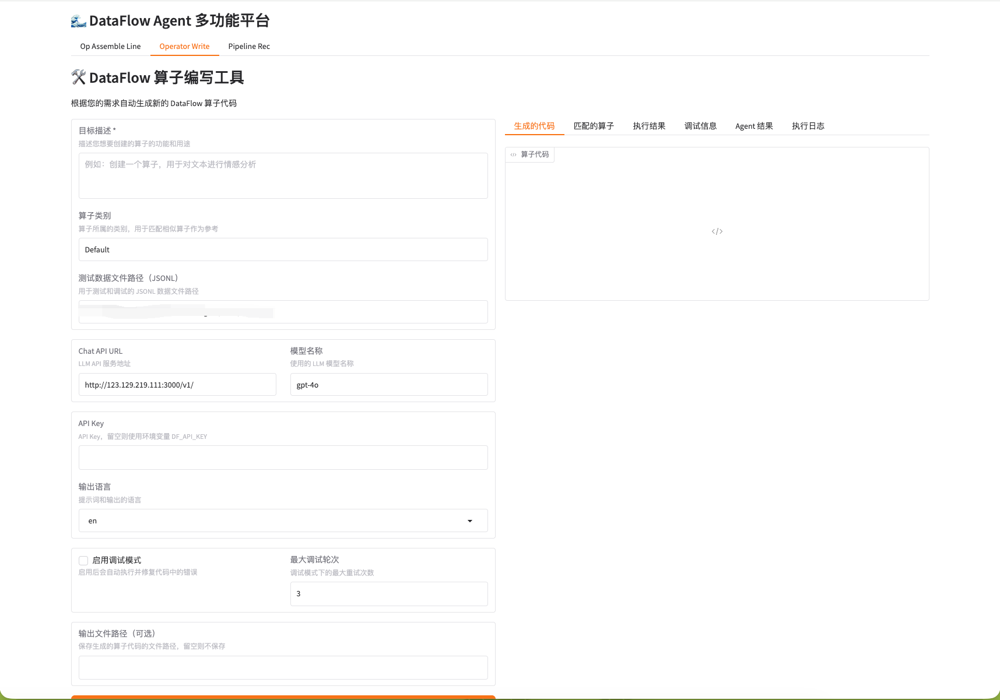
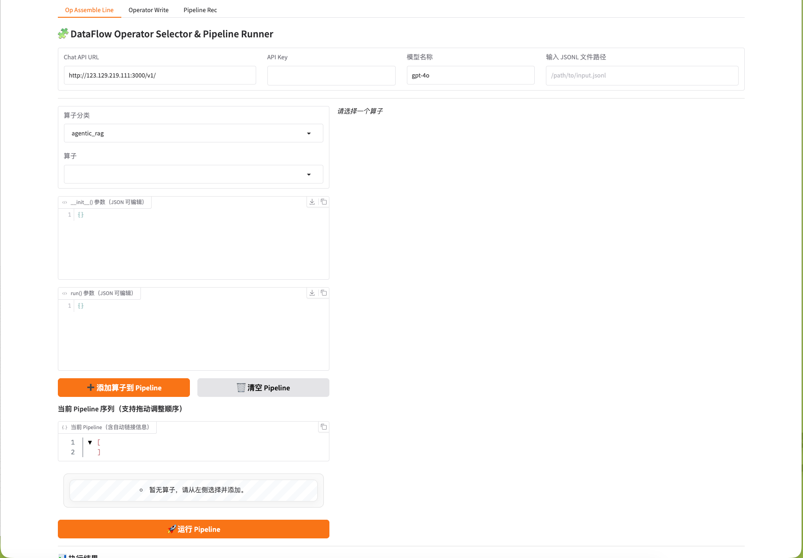

# DataFlow-Agent


<!-- Logo -->
<p align="center">
  
</p>

<!-- Badges -->
<p align="center">
  <!-- License -->
  <a href="LICENSE" title="Apache 2.0 License">
    
  </a>
  <!-- Python -->
  <a href="https://www.python.org/downloads/" title="Python ≥ 3.12">
    
  </a>
  <!-- Docs -->
  <a href="https://your-docs-url" title="项目文档">
    
  </a>
  <!-- Upstream repo -->
  <a href="https://github.com/OpenDCAI/DataFlow" title="上游仓库 OpenDCAI/DataFlow">
    
  </a>
</p>

<!-- 快捷导航 -->
<p align="center">
  <a href="#快速开始">快速开始</a> •
  <a href="#功能特性">功能特性</a> •
  <a href="#贡献指南">贡献指南</a> •
  <a href="https://your-docs-url">文档</a> •
  <a href="https://github.com/OpenDCAI/DataFlow">上游仓库</a>
</p>

---
<!-- 更新通知 -->
> **🎉 最新更新 (2025-11-04)**  
> - 新增手动编排管线，管线推荐以及算子编写；


---

## ✨ 功能特性

- 🔧 **模块化设计**：Agent 和 Workflow 插件式注册，开箱即用
- 🎨 **可视化界面**：基于 Gradio 的交互式 Web 前端
- 🛠️ **CLI 脚手架**：一键生成 Agent、Workflow、Prompt 模板代码
- 📦 **工具管理**：统一的工具注册与调用机制
- 🔄 **工作流编排**：基于 StateGraph 的灵活流程控制

---

## 🚀 快速开始

### 安装

```bash
# 克隆仓库
git clone https://github.com/your-org/DataFlow-Agent.git
cd DataFlow-Agent

# 安装依赖
pip install -r requirements.txt
pip install -e .
```

### 启动 Web 界面

```bash
# 方式一：直接运行
python gradio_app/app.py
```

访问 `http://127.0.0.1:7860` 即可使用。

<div align="center">
  
  
  
</div>


<!-- ### 基础使用示例

```python
from dataflow_agent.workflow import run_workflow
from dataflow_agent.utils.state import AgentState

# 创建任务状态
state = AgentState(task="生成一个数据处理 Pipeline")

# 运行工作流
result = await run_workflow("pipeline_recommend", state)
print(result)
``` -->

---

## 📂 项目结构

```
DataFlow-Agent/
├── dataflow_agent/          # 核心业务代码
│   ├── agentroles/         # Agent 定义（自动注册）
│   ├── workflow/           # Workflow 定义（wf_*.py）
│   ├── promptstemplates/   # 提示词模板
│   ├── tools/              # 工具函数
│   └── utils/              # 工具类（状态、工具管理器等）
├── gradio_app/             # Gradio Web UI
│   ├── app.py             # 主程序
│   └── pages/             # 页面模块（自动发现）
├── docs/                   # MkDocs 文档源文件
├── tests/                  # 单元测试
└── script/                 # 脚本工具
```

<!-- 详细说明请查看 [项目结构文档](docs/project-structure.md)。 -->

---

## 🛠️ CLI 工具

使用 `dfa` 命令快速生成模板代码：

```bash
# 创建新 Agent
dfa create --agent_name my_agent

# 创建新 Workflow
dfa create --wf_name my_workflow

# 创建 Prompt Repo
dfa create --prompt_name my_prompts

# 创建 Gradio 页面
dfa create --gradio_name my_page
```

详细用法请查看 [CLI 工具文档](docs/guides/cli-tool.md)。

---

<!-- ## 🤝 贡献指南

我们热烈欢迎各种形式的贡献！无论是报告 Bug、提出功能建议、改进文档还是提交代码。

### 贡献流程

#### 1️⃣ Fork 并克隆项目

```bash
git clone https://github.com/<your-username>/DataFlow-Agent.git
cd DataFlow-Agent
git checkout -b feature/your-feature-name
```

#### 2️⃣ 安装开发依赖

```bash
pip install -r requirements-dev.txt
pip install -e .
``` -->

<!-- #### 3️⃣ 进行修改

- **代码贡献**：遵循 [代码规范](#代码规范)
- **文档贡献**：详见下方 [贡献文档](#贡献文档)

#### 4️⃣ 运行测试与格式化

```bash
# 运行测试
pytest

# 代码格式化
black dataflow_agent/
isort dataflow_agent/

# 或使用 pre-commit
pre-commit run --all-files
``` -->

<!-- #### 5️⃣ 提交 Pull Request

```bash
git add .
git commit -m "feat: 添加 XXX 功能"
git push origin feature/your-feature-name
```

在 GitHub 上创建 Pull Request，并填写 PR 模板。 -->

---

### 📝 贡献文档

文档对项目至关重要！以下是如何贡献文档的详细步骤。

#### 本地预览文档

**1. 安装 MkDocs**

```bash
pip install mkdocs-material
```

**2. 启动文档服务**

在项目根目录执行：

```bash
mkdocs serve
```

浏览器访问 `http://127.0.0.1:8000`，修改 Markdown 文件后会自动热重载。

#### 添加新文档页面

**步骤 1：创建 Markdown 文件**

在 `docs/` 对应目录下创建文件：

```bash
# 示例：添加性能优化指南
touch docs/guides/performance.md
```

**步骤 2：编写内容**

```markdown
# 性能优化指南

本文介绍如何优化 DataFlow-Agent 的性能...

## 缓存策略
...
```

**步骤 3：更新导航配置**

编辑根目录的 `mkdocs.yml`，在 `nav` 部分添加新页面：

```yaml
nav:
  - 主页: index.md
  - 快速开始: quickstart.md
  - 开发指南:
      - CLI 工具: guides/cli-tool.md
      - 性能优化: guides/performance.md  # ← 新增
```

**步骤 4：预览效果**

刷新浏览器（`http://127.0.0.1:8000`），新页面会出现在导航栏中。

#### 文档文件存放规则

| 文档类型 | 存放位置 | 示例 |
|----------|----------|------|
| 教程/指南 | `docs/guides/` | `guides/agent-development.md` |
| API 参考 | `docs/api-reference/` | `api-reference/agent-api.md` |
| 顶层文档 | `docs/` | `installation.md`、`faq.md` |
| 图片资源 | `docs/assets/` | `assets/architecture.png` |

---

## 贡献代码

### Agent 注册机制

Agent 通过 `@register` 装饰器自动注册：

```python
from dataflow_agent.agentroles.base_agent import BaseAgent
from dataflow_agent.agentroles.registry import register

@register("data_cleaner")  # 注册名称
class DataCleaner(BaseAgent):
    """数据清洗 Agent"""
    
    @classmethod
    def create(cls, tool_manager=None, **kwargs):
        return cls(tool_manager=tool_manager, **kwargs)
```

使用时通过注册名称调用：

```python
from dataflow_agent.agentroles import create_agent

agent = create_agent("data_cleaner", tool_manager=tm)
result = await agent.execute(state)
```

### Workflow 注册机制

Workflow 文件必须以 `wf_` 开头，注册名为去掉前缀的部分：

```python
# 文件：dataflow_agent/workflow/wf_data_validation.py
from dataflow_agent.workflow.registry import register
from dataflow_agent.graghbuilder import GraphBuilder

@register("data_validation")  # 注册名为 "data_validation"
def create_data_validation_graph():
    builder = GraphBuilder()
    # 定义节点和边...
    return builder
```

运行 Workflow：

```python
from dataflow_agent.workflow import run_workflow

result = await run_workflow("data_validation", state)
```

### Gradio 页面自动发现

在 `gradio_app/pages/` 下创建文件，函数名遵循 `create_<filename>` 规则：

```python
# 文件：gradio_app/pages/model_hub.py
import gradio as gr

def create_model_hub():  # 函数名 = create_ + 文件名
    with gr.Blocks() as page:
        gr.Markdown("## 模型中心")
        # 添加组件...
    return page
```

重启 `gradio_app/app.py`，页面自动出现在 Tab 栏。

---
## 新增
- *llm_caller* 新增多模态的api调用；可以通过agent初始化的 use_vlm 参数开启；
  - 目前图像编辑和生成，只支持gemini2.5+我们的api供应商；
  - 支持多模态模型；
- store_outputs 新增agent持久化存储；
- 

---

## 🗓️ Roadmap

- [ ] Paper系列agent集成
  - [ ] paper2video
  - [ ] paper2web
  - [ ] paper2poster
  - [ ] paper2gragh
- [ ] DataAgent集成
  - [ ] 多数据源深度分析 + 报告
  - [ ] 智能取数

<!-- ---

## 📚 文档

- [完整文档](https://your-docs-url.com)
- [快速开始](docs/quickstart.md)
- [CLI 工具使用](docs/guides/cli-tool.md)
- [Agent 开发指南](docs/guides/agent-development.md)
- [Workflow 开发指南](docs/guides/workflow-development.md)
- [添加 Gradio 页面](docs/guides/add-gradio-page.md)

--- -->

<!-- ## 🧪 运行测试

```bash
# 运行所有测试
pytest

# 运行特定测试文件
pytest tests/test_agent.py

# 查看覆盖率
pytest --cov=dataflow_agent --cov-report=html
```

--- -->

## 📄 License

本项目采用 [Apache License 2.0](LICENSE) 开源协议。

---

## 🙏 致谢

感谢所有贡献者的辛勤付出！

---

## 📞 联系我们

- **Issue**: [提交问题](https://github.com/your-org/DataFlow-Agent/issues)
<!-- - **Discussions**: [参与讨论](https://github.com/your-org/DataFlow-Agent/discussions)
- **邮件**: dev@example.com -->

---

<div align="center">

**如果这个项目对你有帮助，请给我们一个 ⭐️ Star！**

</div>

---

## 📝 更新日志

<!-- 查看 [CHANGELOG.md](CHANGELOG.md) 了解版本历史和更新内容。 -->