<div align="center">

<br>

# DataFlow-Agent

**AI-Powered Data & Paper Workflow Orchestration Platform**

[](https://www.python.org/)
[](LICENSE)
[](https://github.com/OpenDCAI/DataFlow)
[](https://github.com/OpenDCAI/DataFlow-Agent/stargazers)

*从数据与论文到 AI 工作流，一站式编排平台*

[快速开始](#-快速开始) • [在线体验](http://dcai-paper2figure.cpolar.top/) • [文档](docs/) • [贡献指南](docs/contributing.md)

</div>

---

## 📑 目录

- [🔥 News](#-news)
- [📐 项目架构](#-项目架构)
- [✨ 核心应用](#-核心应用)
  - [Paper2Any - 论文多模态工作流](#1️⃣-paper2any---论文多模态工作流)
  - [Easy-DataFlow - 数据治理管线](#2️⃣-easy-dataflow---数据治理管线)
  - [DataFlow-Table - 多源数据分析](#3️⃣-dataflow-table---多源数据分析)
- [🚀 快速开始](#-快速开始)
- [📂 项目结构](#-项目结构)
- [🗺️ Roadmap](#️-roadmap)
- [🤝 贡献](#-贡献)

---

## 🔥 News

<table>
<tr>
<td width="120"><strong>2025.12.12</strong></td>
<td>
🎉 <strong>Paper2Figure 网页端内测上线</strong>（需邀请码）<br>
支持一键生成多种<strong>可编辑</strong>科研绘图，包括模型架构图、技术路线图、实验数据图<br>
👉 访问地址：<a href="http://dcai-paper2figure.cpolar.top/">http://dcai-paper2figure.cpolar.top/</a>
</td>
</tr>
<tr>
<td><strong>2024.09.01</strong></td>
<td>
🚀 发布 <code>0.1.0</code> 首个版本（详见 <a href="docs/changelog.md">changelog</a>）
</td>
</tr>
</table>

<div align="center">

</div>

---

## 📐 项目架构


<div align="center">
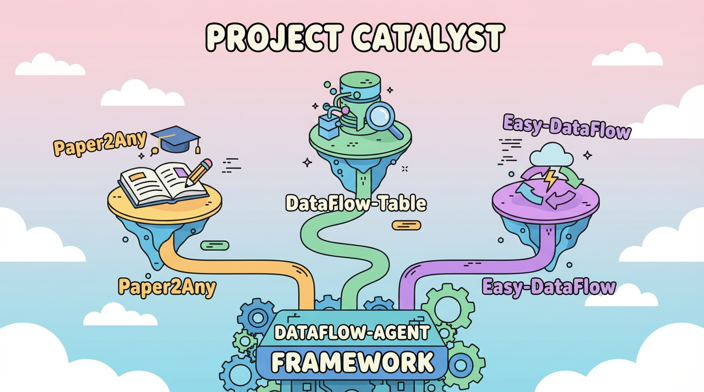
</div>


---

## ✨ 核心应用

### 1️⃣ Paper2Any - 论文多模态工作流

> 从论文 PDF/图片/文本，一键生成可编辑的科研绘图、视频脚本、海报等多模态内容

#### 🎯 核心功能

<table>
<tr>
<td width="50%" valign="top">

**📊 Paper2Figure - 可编辑科研绘图**
- ✅ 模型架构图生成
- ✅ 技术路线图生成（PPT + SVG）
- ✅ 实验数据图生成
- ✅ 支持 PDF / 图片 / 文本输入
- ✅ 输出可编辑 PPTX 格式

</td>
<td width="50%" valign="top">

**🎬 Paper2PPT - 可编辑演示文稿**
- ✅ Beamer 版本 PPT 生成
- 🚧 开放式可编辑 PPT 生成（开发中）

</td>
</tr>
<tr>
<td valign="top">

**🎬 Paper2Video - 论文讲解视频**
- 🚧 自动生成视频脚本
- 🚧 分镜描述与时间轴
- 🚧 配图素材推荐
- 🚧 视频自动合成（开发中）

</td>
<td valign="top">

**📌 Paper2Poster - 可编辑学术海报**
- 🚧 版式自动设计
- 🚧 要点提炼
- 🚧 视觉优化

</td>
</tr>
</table>

---

#### 📸 ShowCase - Paper2Figure

##### 模型架构图生成

<table>
<tr>
<th width="33%">输入</th>
<th width="33%">生成图</th>
<th width="33%">PPTX 截图</th>
</tr>
<tr>
<td align="center">

<br><sub>📄 论文 PDF</sub>
</td>
<td align="center">

<br><sub>🎨 生成的模型架构图</sub>
</td>
<td align="center">
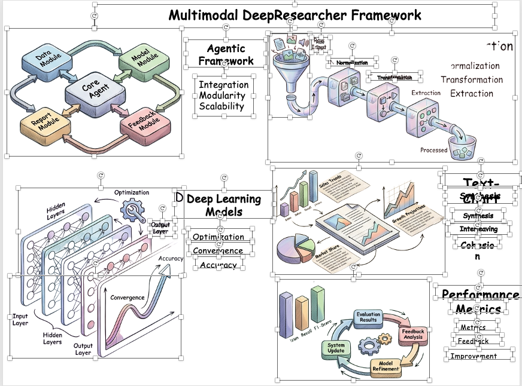
<br><sub>📊 可编辑 PPTX</sub>
</td>
</tr>
<tr>
<td colspan="3" align="center">
<strong>绘图难度：简单</strong> - 基础模型结构，清晰的模块划分
</td>
</tr>
<tr>
<td align="center">
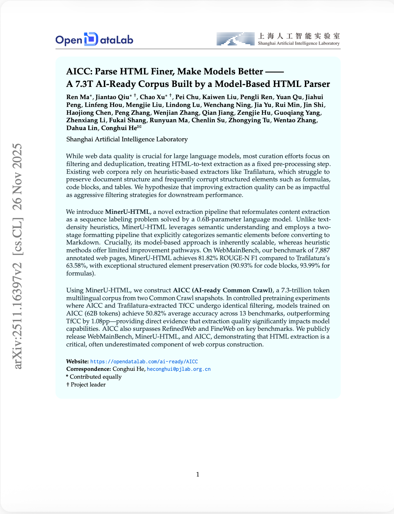
<br><sub>📄 论文PDF</sub>
</td>
<td align="center">
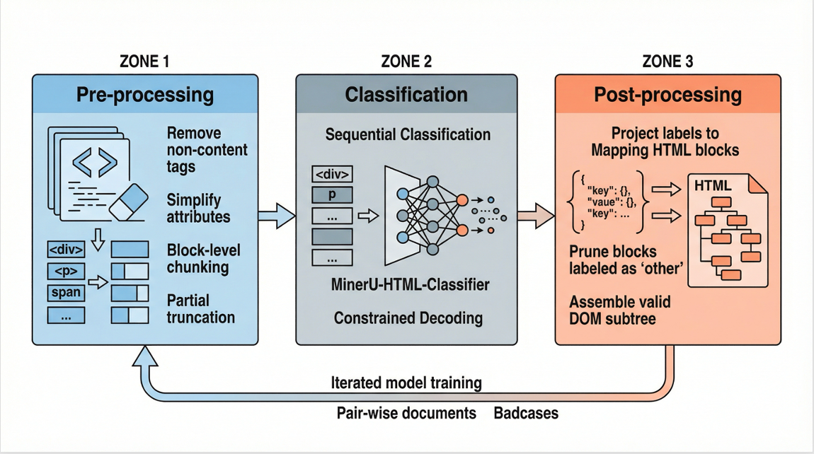
<br><sub>🎨 生成的模型架构图</sub>
</td>
<td align="center">
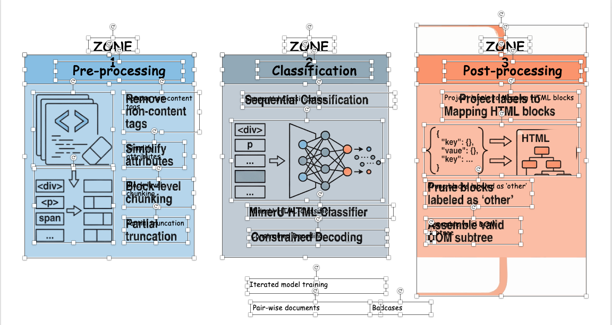
<br><sub>📊 可编辑 PPTX</sub>
</td>
</tr>
<tr>
<td colspan="3" align="center">
<strong>绘图难度：中等</strong> - 包含多层次结构和数据流
</td>
</tr>
<tr>
<td align="center">
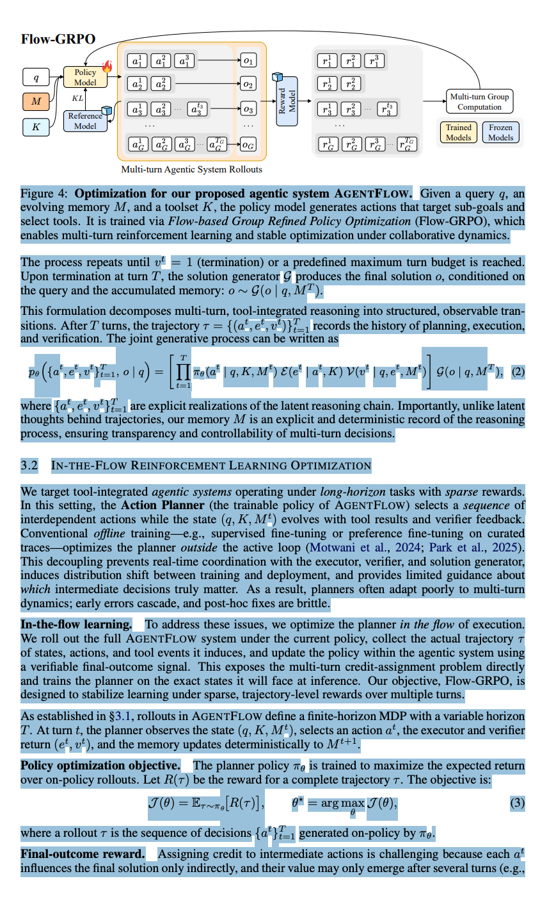
<br><sub>📄 输入核心段落</sub>
</td>
<td align="center">

<br><sub>🎨 生成的模型架构图</sub>
</td>
<td align="center">
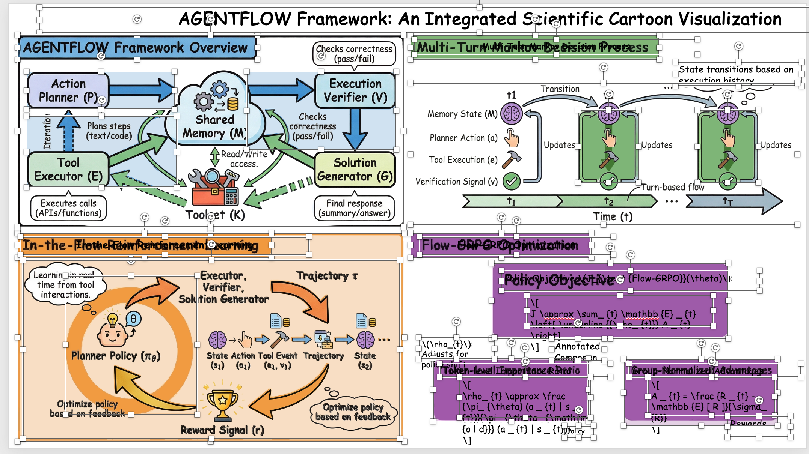
<br><sub>📊 可编辑 PPTX</sub>
</td>
</tr>
<tr>
<td colspan="3" align="center">
<strong>绘图难度：困难</strong> - 复杂的多模块交互和详细注释
</td>
</tr>
</table>

<div align="center">

上传论文 PDF 文件，根据选择的**绘图难度**（简单/中等/困难），自动提取模型架构信息，生成对应复杂度的**可编辑 PPTX 格式**模型架构图。

</div>

---

##### 技术路线图生成

<table>
<tr>
<th width="33%">输入</th>
<th width="33%">生成图（SVG）</th>
<th width="33%">PPTX 截图</th>
</tr>
<tr>
<td align="center">
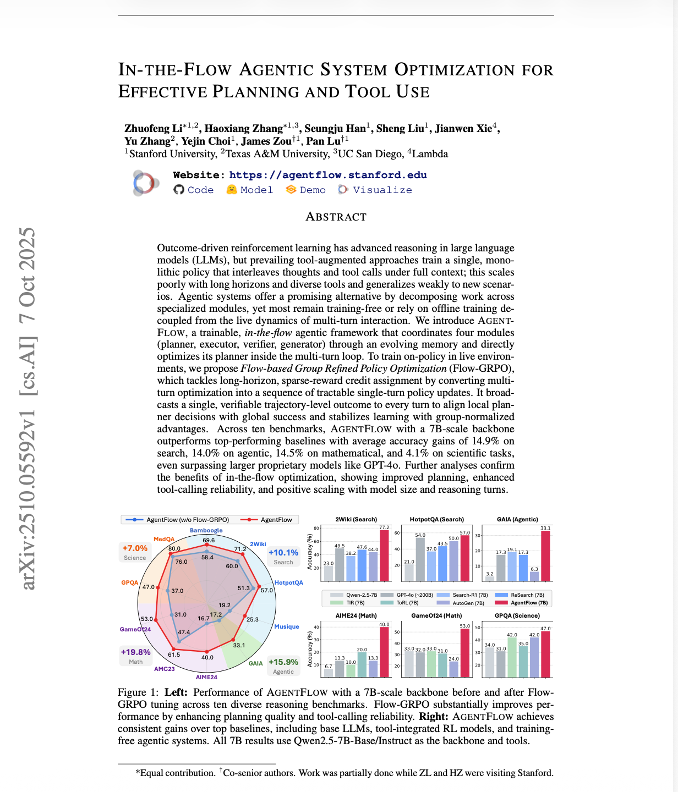
<br><sub>📝 论文方法部分（中文）</sub>
</td>
<td align="center">
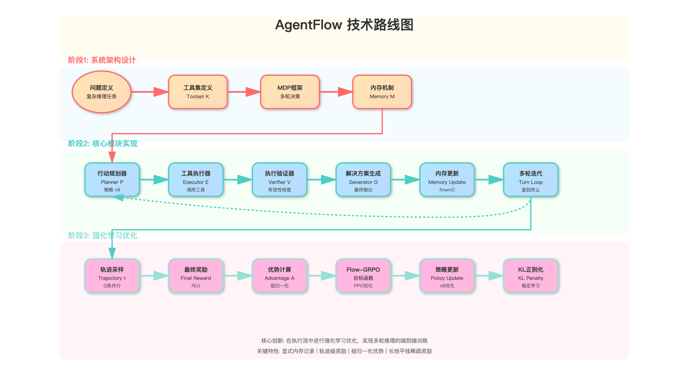
<br><sub>🗺️ 技术路线图 SVG</sub>
</td>
<td align="center">
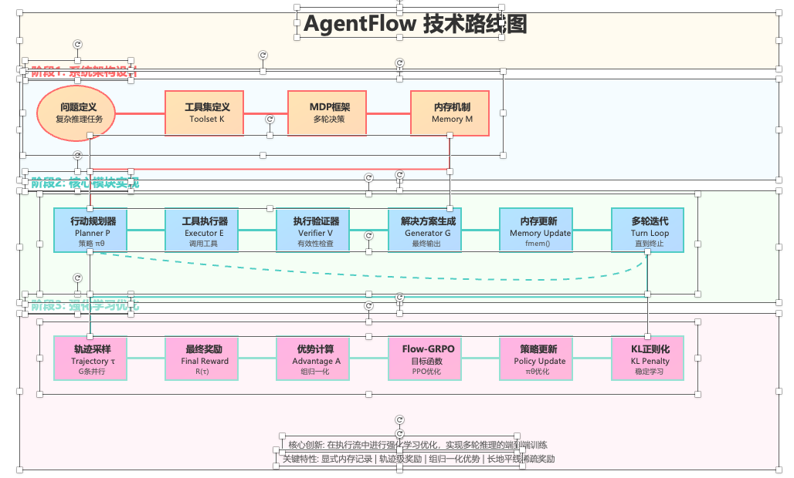
<br><sub>📊 可编辑 PPTX</sub>
</td>
</tr>
<tr>
<td colspan="3" align="center">
<strong>语言：中文</strong> - 中文技术路线图，适合国内学术交流
</td>
</tr>
<tr>
<td align="center">
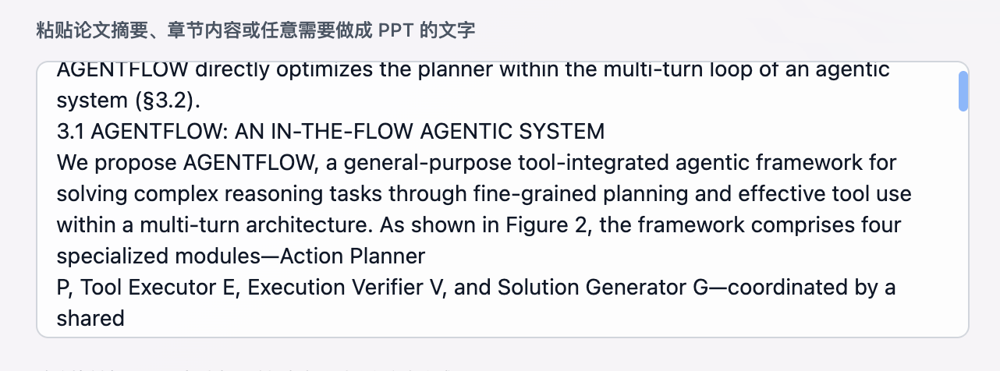
<br><sub>📝 论文方法部分（英文）</sub>
</td>
<td align="center">
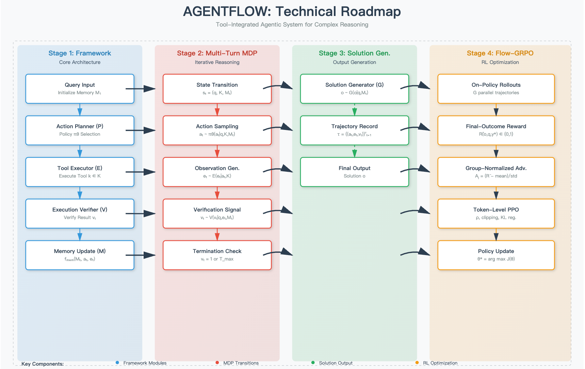
<br><sub>🗺️ 技术路线图 SVG</sub>
</td>
<td align="center">
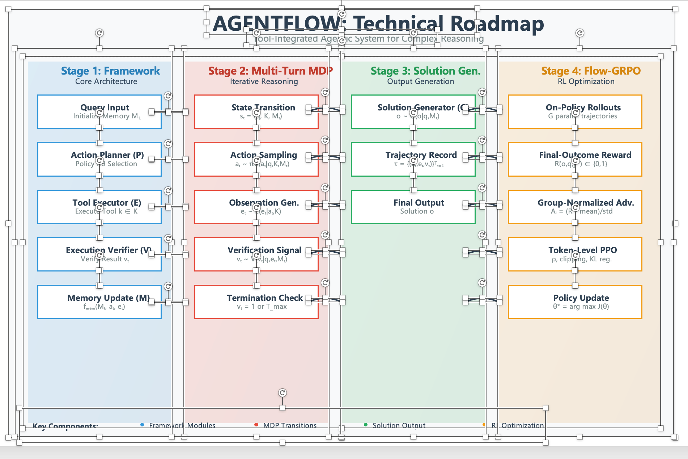
<br><sub>📊 可编辑 PPTX</sub>
</td>
</tr>
<tr>
<td colspan="3" align="center">
<strong>语言：英文</strong> - 英文技术路线图，适合国际学术发表
</td>
</tr>
</table>

<div align="center">

粘贴论文方法部分文本，选择**语言**（中文/英文），自动梳理技术路线与模块依赖关系，生成**清晰的技术路线图 PPTX 与可编辑 SVG**。

</div>

---

##### 实验数据图生成

<table>
<tr>
<td width="50%" align="center">

<br><sub>📸 输入：实验结果截图</sub>
</td>
<td width="50%" align="center">

<br><sub>📈 输出：结构化实验数据图 PPTX</sub>
</td>
</tr>
</table>

<div align="center">

上传实验结果截图，自动提取数据并生成**结构化的实验数据图 PPTX**，便于直观展示研究成果。

</div>

---

#### 🖥️ 使用方式

**方式一：Web 前端（推荐）**

(目前在线版只支持邀请用户体验)访问在线体验地址：[http://dcai-paper2figure.cpolar.top/](http://dcai-paper2figure.cpolar.top/)

<div align="center">

</div>

**特点**：
- 🎨 现代化 UI 设计
- 📤 支持拖拽上传
- ⚙️ 可视化参数配置
- 📊 实时进度展示
- 📥 一键下载结果

<!-- 
**方式二：Gradio 界面**

```bash
python gradio_app/app.py
```

访问 `http://127.0.0.1:7860`

**特点**：
- 🚀 快速部署
- 🔧 灵活配置
- 📝 支持批量处理
-->

---

### 2️⃣ Easy-DataFlow - 数据治理管线

> 从任务描述到可执行数据处理管线，AI 驱动的数据治理全流程

#### 🎯 核心功能

| 功能模块 | 说明 | 状态 |
|---------|------|------|
| 📊 **管线推荐** | 从任务描述自动生成可执行 Python 管线代码 | ✅ |
| ✍️ **算子编写** | AI 辅助编写自定义数据处理算子 | ✅ |
| 🎨 **可视化编排** | 拖拽式构建数据处理流程 | ✅ |
| 🔄 **Prompt 优化** | 自动优化算子提示词，提升效果 | ✅ |
| 🌐 **Web 采集** | 自动化网页数据采集与结构化 | ✅ |

---

#### 📸 功能展示

**管线推荐：从任务到代码**

<div align="center">

<br><sub>💻 智能分析任务需求，自动推荐最优算子组合，生成可执行的 Python 管线代码</sub>
</div>

---

**算子编写：AI 辅助开发**

<div align="center">

<br><sub>⚙️ 使用 LLM 辅助从功能描述自动生成算子代码，并在同一界面内完成测试与调试</sub>
</div>

---

**可视化编排：拖拽式构建**

<div align="center">

<br><sub>🎨 通过可视化界面拖拽组合算子，自由搭建数据处理流程，所见即所得</sub>
</div>

---

**Prompt 优化：自动调优**

<div align="center">

<br><sub>✨ 复用现有算子，自动书写 DataFlow 的算子 Prompt Template，智能优化提示词</sub>
</div>

---

**Web 采集：网页到数据**

<div align="center">

<br><sub>📊 自动化网页数据采集与结构化转换，直接输出 DataFlow-ready 数据</sub>
</div>

---

### 3️⃣ DataFlow-Table - 多源数据分析

> 一站式接入多源数据，自动化分析与洞察生成

#### 🚧 正在开发中

DataFlow-Table 正在积极开发中，敬请期待！

**计划功能**：
- 📥 多数据源接入（数据库 / 文件 / Web / API）
- 🧹 智能清洗与标准化
- 📊 基于 AI 的自动分析
- 📝 自然语言分析报告生成
- 📈 交互式图表与报表

---

## 🚀 快速开始

### 环境要求


### 安装步骤

```bash
# 1. 克隆仓库
git clone https://github.com/OpenDCAI/DataFlow-Agent.git
cd DataFlow-Agent

# 2. 安装依赖
pip install -r requirements.txt

# 3. 安装包（开发模式）
pip install -e .
```

### 配置环境

```bash
# 复制配置模板
cp .env.example .env

# 编辑配置文件，添加 API Key 等参数
vim .env
```

详细配置参考：[docs/installation.md](docs/installation.md)

---

### 启动应用

#### 🎨 Paper2Any - 论文工作流

**Web 前端（推荐）**

```bash
# 启动后端 API
cd fastapi_app
uvicorn main:app --host 0.0.0.0 --port 8000

# 启动前端（新终端）
cd frontend-workflow
npm install
npm run dev
```

访问 `http://localhost:5173`

**特点**：
- ✨ 现代化 UI 设计
- 🎯 可视化参数配置
- 📊 实时进度展示
- 📥 一键下载结果

---

#### 📊 Easy-DataFlow - 数据治理

**Gradio Web 界面**

```bash
python gradio_app/app.py
```

访问 `http://127.0.0.1:7860`

**特点**：
- 🚀 快速部署
- 🔧 灵活配置
- 📝 支持批量处理

**CLI 命令行**

```bash
# 数据管线推荐
dataflow-agent run pipeline_recommend \
  --input data.csv \
  --task "为用户行为数据生成画像"

# Prompt 优化
dataflow-agent run pipeline_prompt_refine \
  --op my_operator \
  --goal "提升召回率"
```

---

#### 🔍 DataFlow-Table - 数据分析

🚧 **正在开发中，敬请期待！**

---

## 📂 项目结构

```
DataFlow-Agent/
├── dataflow_agent/          # 核心框架代码
│   ├── agentroles/         # Agent 定义（@register 自动注册）
│   ├── workflow/           # Workflow 定义（wf_*.py）
│   ├── promptstemplates/   # Prompt 模板库
│   ├── toolkits/           # 工具集（LLM/Docker/Image 等）
│   ├── graphbuilder/       # StateGraph 构建器
│   └── states/             # 状态管理
├── gradio_app/             # Gradio Web 界面
│   ├── app.py             # 主程序
│   └── pages/             # 页面模块（自动发现）
├── fastapi_app/            # FastAPI 后端服务
│   ├── main.py            # API 入口
│   └── routers/           # 路由模块
├── frontend-workflow/      # 前端工作流编辑器
│   ├── src/               # 源代码
│   └── public/            # 静态资源
├── docs/                   # 文档
├── static/                 # 静态资源（图片等）
├── script/                 # 脚本工具
└── tests/                  # 测试用例
```

---

## 🗺️ Roadmap

### 🎓 Paper 系列（进行中）

- [x] **Paper2Figure** - 可编辑科研绘图
  - [x] 模型架构图
  - [x] 技术路线图
  - [x] 实验数据图
  - [x] Web 前端界面
- [x] **Paper2Video** - 论文讲解视频脚本
- [ ] **Paper2Web** - 交互式网页
- [ ] **Paper2Poster** - 学术海报
- [ ] **Paper2Code** - 论文转代码
- [ ] **PaperCiter** - 智能文献引用

### 📊 Data 系列（进行中）

- [x] **Easy-DataFlow** - 数据治理管线
  - [x] 管线推荐
  - [x] 算子编写
  - [x] 可视化编排
  - [x] Prompt 优化
  - [x] Web 采集
- [ ] **DataFlow-Table** - 多源数据分析
  - [ ] 多数据源深度分析
  - [ ] 智能取数与血缘追踪
  - [ ] 高级可视化报表

### 🛠️ 工具增强

- [ ] **Workflow 可视化编辑器**
  - 拖拽式创建专属工作流
  - 支持 5 种 Agent 模式
  - 20+ 预设 Agent 节点

<div align="center">

<br><sub>🎨 Workflow 可视化编辑器预览</sub>
</div>

- [ ] **轨迹数据导出**
  - JSON/JSONL 格式
  - SFT 训练数据格式
  - DPO 成对数据格式

---

## 🤝 贡献

我们欢迎所有形式的贡献！

[](https://github.com/OpenDCAI/DataFlow-Agent/issues)
[](https://github.com/OpenDCAI/DataFlow-Agent/discussions)
[](https://github.com/OpenDCAI/DataFlow-Agent/pulls)

详细贡献指南：[docs/contributing.md](docs/contributing.md)

---

## 📄 License

[](LICENSE)

本项目采用 [Apache License 2.0](LICENSE) 开源协议

---

## 🙏 致谢

感谢所有贡献者！特别感谢 [OpenDCAI/DataFlow](https://github.com/OpenDCAI/DataFlow) 上游项目

---

<div align="center">

**如果这个项目对你有帮助，请给我们一个 ⭐️ Star！**

[](https://github.com/OpenDCAI/DataFlow-Agent/stargazers)
[](https://github.com/OpenDCAI/DataFlow-Agent/network/members)

[提交 Issue](https://github.com/OpenDCAI/DataFlow-Agent/issues) • [查看文档](docs/) • [加入讨论](https://github.com/OpenDCAI/DataFlow-Agent/discussions)

Made with ❤️ by OpenDCAI Team

</div>
