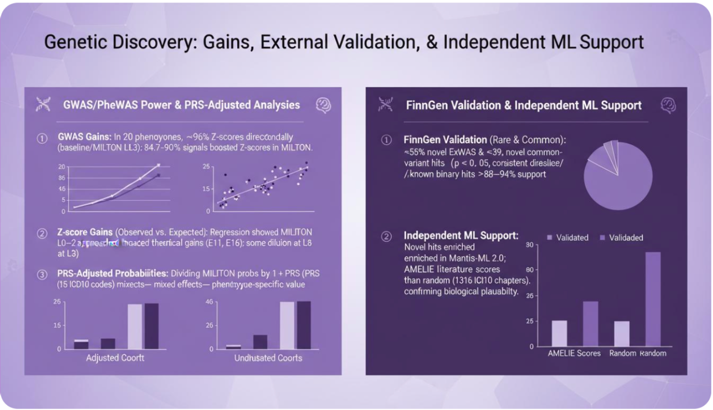

<div align="center">


# Paper2Any

<!-- **从论文与原始数据，到图表、PPT 和数据管线的一站式 AI Orchestrator** -->

[](https://www.python.org/)
[](LICENSE)
[](https://github.com/OpenDCAI/Paper2Any)
[](https://github.com/OpenDCAI/Paper2Any/stargazers)

中文 | [English](README_EN.md)

<a href="#-快速开始" target="_self">
  
</a>
<a href="http://dcai-paper2any.nas.cpolar.cn/" target="_blank">
  
</a>
<a href="docs/" target="_blank">
  
</a>
<a href="docs/contributing.md" target="_blank">
  
</a>

*专注论文多模态工作流：从论文 PDF/截图/文本，一键生成模型示意图、技术路线图、实验图和演示文稿*

</div>

<div align="center">
  
  <span>&nbsp;|&nbsp;</span>
  
</div>

---

## 📢 Roadmap & 拆分公告

> [!IMPORTANT]
> **本项目正在进行架构拆分，以提供更专注的功能体验。**

- **[Paper2Any](https://github.com/OpenDCAI/Paper2Any)** (本仓库)：
  - 专注于论文多模态工作流（Paper2Figure, Paper2PPT, Paper2Video 等）。
  - 为科研人员提供一键式绘图、PPT 生成和视频脚本辅助工具。

- **[DataFlow-Agent](https://github.com/OpenDCAI/DataFlow-Agent)** (新仓库)：
  - 专注于 DataFlow 算子编排和编写。
  - 提供通用的多智能体数据流处理框架和算子开发工具。

---

## 📑 目录

- [🔥 News](#-news)
- [✨ 核心功能](#-核心功能)
- [📸 功能展示](#-功能展示)
- [🚀 快速开始](#-快速开始)
- [📂 项目结构](#-项目结构)
- [🗺️ 开发计划](#️-开发计划)
- [🤝 贡献](#-贡献)

---

## 🔥 News

> [!TIP]
> 🆕 <strong>2025-12-12 · Paper2Figure 网页端公测上线</strong><br>
> 支持一键生成多种<strong>可编辑</strong>科研绘图（模型架构图 / 技术路线图 / 实验数据图）<br>
> 🌐 在线体验：<a href="http://dcai-paper2any.nas.cpolar.cn/">http://dcai-paper2any.nas.cpolar.cn/</a>

- 2024-09-01 · 发布 <code>0.1.0</code> 首个版本

---

## ✨ 核心功能

> 从论文 PDF / 图片 / 文本出发，一键生成**可编辑**的科研绘图、演示文稿、视频脚本、学术海报等多模态内容。

Paper2Any 当前包含以下几个子能力：

<table>
<tr>
<td width="50%" valign="top">

**📊 Paper2Figure - 可编辑科研绘图**
- ✅ 模型架构图生成
- ✅ 技术路线图生成（PPT + SVG）
- ✅ 实验数据图生成 (优化中)
- ✅ 支持 PDF / 图片 / 文本输入
- ✅ 输出可编辑 PPTX 格式

</td>
<td width="50%" valign="top">

**🎬 Paper2PPT - 可编辑演示文稿**
- ✅ Beamer 版本 PPT 生成
- ✅ 开放式可编辑 PPT 生成
- ✅ PDF2PPT 转换，背景保留+可编辑

</td>
</tr>
<tr>
<td valign="top">

**🎬 Paper2Video - 论文讲解视频**
- 🚧 自动生成视频脚本
- 🚧 分镜描述与时间轴
- 🚧 配图素材推荐
- 🚧 视频自动合成（开发中）

</td>
<td valign="top">

**📌 Paper2Poster - 可编辑学术海报**
- 🚧 版式自动设计
- 🚧 要点提炼
- 🚧 视觉优化

</td>
</tr>
</table>

---

## 📸 功能展示

### 1. Paper2PPT - 论文转演示文稿

#### 论文 PDF 转 PPT

<table>
<tr>
<th width="25%">输入</th>
<th width="25%">输出</th>
<th width="25%">输入</th>
<th width="25%">输出</th>
</tr>
<tr>
<td align="center">

<br><sub>📄 论文 PDF</sub>
</td>
<td align="center">

<br><sub>📊 生成的 PPT</sub>
</td>
<td align="center">

<br><sub>📝 论文内容</sub>
</td>
<td align="center">

<br><sub>📊 生成的 PPT</sub>
</td>
</tr>
<tr>
<td colspan="4" align="center">
<strong>PPT 生成</strong> - 上传论文 PDF，自动提取关键信息，生成结构化的学术汇报 PPT；智能分析内容，自动插入图表。
</td>
</tr>
</table>

#### PDF2PPT - PDF 转可编辑 PPT

<table>
<tr>
<th width="25%">输入</th>
<th width="25%">输出</th>
<th width="25%">输入</th>
<th width="25%">输出</th>
</tr>
<tr>
<td align="center">

<br><sub>📄 PDF 页面</sub>
</td>
<td align="center">

<br><sub>📊 生成的 PPT (白底)</sub>
</td>
<td align="center">

<br><sub>📄 PDF 页面</sub>
</td>
<td align="center">

<br><sub>📊 生成的 PPT (AI重绘)</sub>
</td>
</tr>
</table>

#### PPT Polish - 智能美化

<table>
<tr>
<th width="25%">原始 PPT</th>
<th width="25%">增色后</th>
<th width="25%">原始 PPT</th>
<th width="25%">润色后</th>
</tr>
<tr>
<td align="center">

</td>
<td align="center">

</td>
<td align="center">

</td>
<td align="center">

</td>
</tr>
</table>

---

### 2. Paper2Figure - 科研绘图生成

#### 模型架构图生成

<table>
<tr>
<th width="33%">输入</th>
<th width="33%">生成图</th>
<th width="33%">PPTX 截图</th>
</tr>
<tr>
<td align="center">

<br><sub>📄 论文 PDF</sub>
</td>
<td align="center">

<br><sub>🎨 生成的模型架构图</sub>
</td>
<td align="center">

<br><sub>📊 可编辑 PPTX</sub>
</td>
</tr>
</table>

<div align="center">
上传论文 PDF，根据选择的难度（简单/中等/困难），自动生成<strong>可编辑 PPTX 格式</strong>模型架构图。
</div>

#### 技术路线图生成

<table>
<tr>
<th width="33%">输入</th>
<th width="33%">生成图（SVG）</th>
<th width="33%">PPTX 截图</th>
</tr>
<tr>
<td align="center">

<br><sub>📝 论文方法部分</sub>
</td>
<td align="center">

<br><sub>🗺️ 技术路线图 SVG</sub>
</td>
<td align="center">

<br><sub>📊 可编辑 PPTX</sub>
</td>
</tr>
</table>

#### 实验数据图生成

<table>
<tr>
<th width="33%">输入</th>
<th width="33%">常规风格</th>
<th width="33%">手绘风格</th>
</tr>
<tr>
<td align="center">
  
  <br><sub>📄 实验结果截图</sub>
</td>
<td align="center">
  
  <br><sub>📈 常规 Python 风格</sub>
</td>
<td align="center">
  
  <br><sub>🎨 手绘风格</sub>
</td>
</tr>
</table>

---

## 🚀 快速开始

### 环境要求


---

### 🐧 Linux 安装

> 建议使用 Conda 创建隔离环境（推荐 Python 3.11）。

```bash
# 0. 创建并激活 conda 环境
conda create -n paper2any python=3.11 -y
conda activate paper2any

# 1. 克隆仓库
git clone https://github.com/OpenDCAI/Paper2Any.git
cd Paper2Any

# 2. 安装基础依赖
pip install -r requirements-base.txt

# 3. 开发模式安装
pip install -e .
```

#### 安装 Paper2Any 额外依赖（必须）

Paper2Any 涉及 LaTeX 渲染、矢量图处理以及 PPT/PDF 转换，需要额外依赖：

```bash
# 1. Python 依赖
pip install -r requirements-paper.txt || pip install -r requirements-paper-backup.txt

# 2. LaTeX 引擎 (tectonic) - 推荐用 conda 安装
conda install -c conda-forge tectonic -y

# 3. 解决 doclayout_yolo 依赖冲突（重要）
pip install doclayout_yolo --no-deps

# 4. 系统依赖 (Ubuntu 示例)
sudo apt-get update
sudo apt-get install -y inkscape libreoffice poppler-utils wkhtmltopdf
```

#### 配置环境变量

```bash
export DF_API_KEY=your_api_key_here
export DF_API_URL=xxx  # 可选：如需使用第三方 API 中转站

# [可选] 配置 MinerU PDF 解析任务的 GPU 资源池
export MINERU_DEVICES="0,1,2,3"
```

---

### 启动 Web 前端（推荐）

```bash
# 1. 启动后端 API
cd fastapi_app
uvicorn main:app --host 0.0.0.0 --port 8000

# 2. 启动前端（新终端）
cd frontend-workflow
npm install
npm run dev
```

访问 `http://localhost:3000` 即可使用。

> [!TIP]
> 如果暂时不想部署前后端，可以通过本地脚本体验核心功能：
> - `python script/run_paper2figure.py`：模型架构图生成
> - `python script/run_paper2ppt.py`：论文生成 PPT
> - `python script/run_pdf2ppt_with_paddle_sam_mineru.py`：PDF 转 PPT

---

## 📂 项目结构

```
Paper2Any/
├── dataflow_agent/          # 核心代码库
│   ├── agentroles/         # Agent 定义
│   │   └── paper2any_agents/ # Paper2Any 专用 Agent
│   ├── workflow/           # Workflow 定义
│   ├── promptstemplates/   # Prompt 模板
│   └── toolkits/           # 工具集（绘图、PPT生成等）
├── fastapi_app/            # 后端 API 服务
├── frontend-workflow/      # 前端 Web 界面
├── static/                 # 静态资源
├── script/                 # 脚本工具
└── tests/                  # 测试用例
```

---

## 🗺️ 开发计划

<table>
<tr>
<th width="35%">功能</th>
<th width="15%">状态</th>
<th width="50%">子功能</th>
</tr>
<tr>
<td><strong>📊 Paper2Figure</strong><br><sub>可编辑科研绘图</sub></td>
<td></td>
<td>
<br>
<br>
<br>

</td>
</tr>
<tr>
<td><strong>🎬 Paper2Video</strong><br><sub>论文讲解视频</sub></td>
<td></td>
<td>
<br>
<br>

</td>
</tr>
<tr>
<td><strong>🎬 Paper2PPT</strong><br><sub>可编辑演示文稿</sub></td>
<td></td>
<td>
<br>

</td>
</tr>
</table>

---

## 🤝 贡献

我们欢迎所有形式的贡献！

[](https://github.com/OpenDCAI/Paper2Any/issues)
[](https://github.com/OpenDCAI/Paper2Any/discussions)
[](https://github.com/OpenDCAI/Paper2Any/pulls)

---

## 📄 License

[](LICENSE)

本项目采用 [Apache License 2.0](LICENSE) 开源协议

---

<div align="center">

**如果这个项目对你有帮助，请给我们一个 ⭐️ Star！**

[](https://github.com/OpenDCAI/Paper2Any/stargazers)
[](https://github.com/OpenDCAI/Paper2Any/network/members)

[提交 Issue](https://github.com/OpenDCAI/Paper2Any/issues) • [加入讨论](https://github.com/OpenDCAI/Paper2Any/discussions)

Made with ❤️ by OpenDCAI Team

</div>

---

## 🌐 加入社区

- 📮 **GitHub Issues**：用于反馈 Bug 或提交功能建议  
  👉 https://github.com/OpenDCAI/Paper2Any/issues
- 💬 **社区交流群**：与开发者和贡献者实时交流

<div align="center">
  
  <br>
  <sub>扫码加入社区微信群</sub>
</div>
